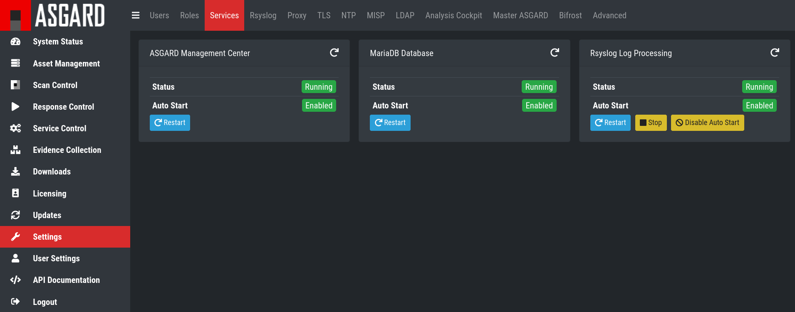
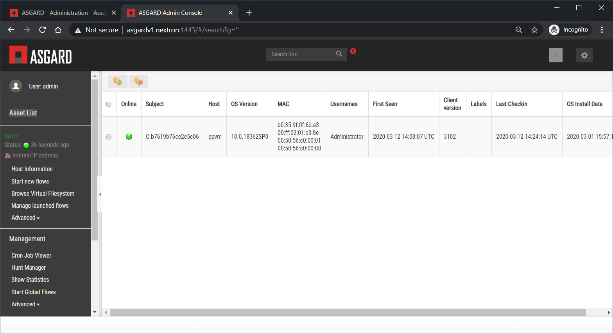
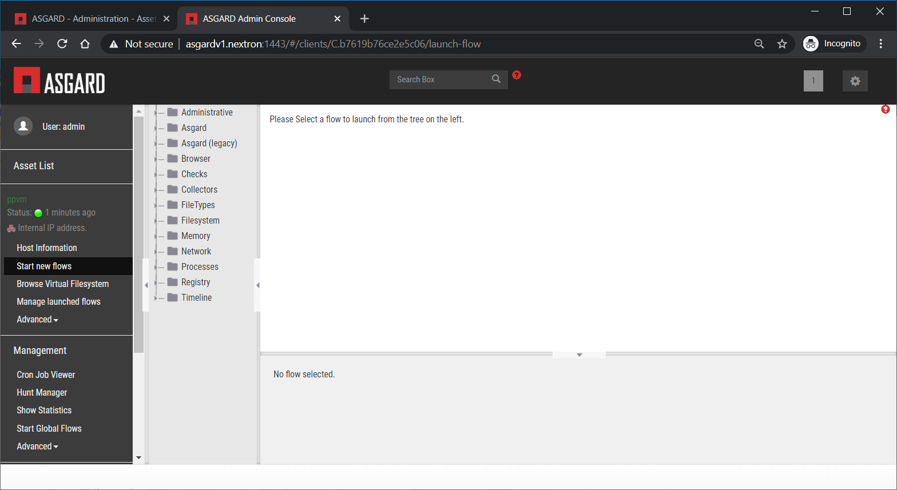
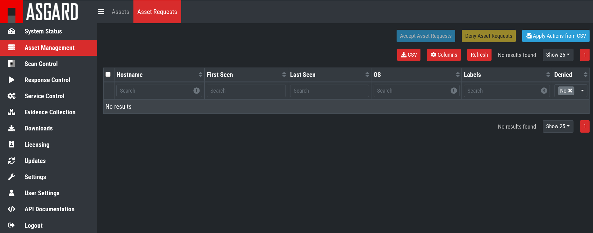
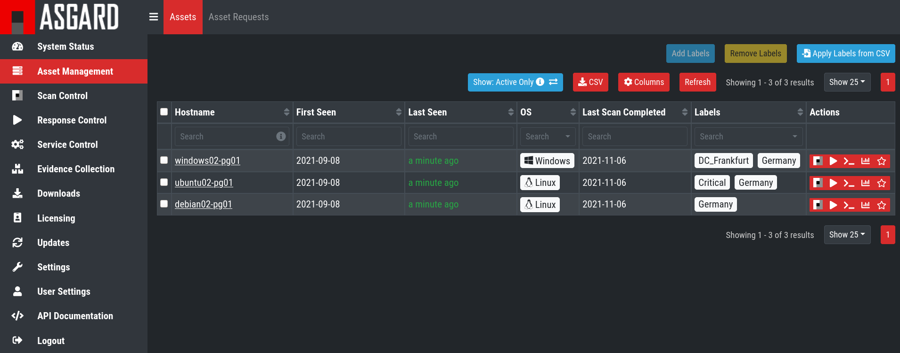

Appendix
========

Install TLS certificates on ASGARD and Master ASGARD
----------------------------------------------------

There are several methods to sign the ASGARD generated CSR request. This section describes the two most common procedures.

Use Case 1 - CSR Signing with a Microsoft Based CA
^^^^^^^^^^^^^^^^^^^^^^^^^^^^^^^^^^^^^^^^^^^^^^^^^^

Open the Certificate Authority snap-in within Windows Server

.. figure:: ../images/image96-1592779517437.PNG
   :target: ../_images/image96-1592779517437.PNG
   :alt: image96

   certsrv – Microsoft Certification Authority Main Page

Right click your CA >> All Tasks >> Submit new request

.. figure:: ../images/image97-1592779543622.PNG
   :target: ../_images/image97-1592779543622.PNG
   :alt: image97

   certsrv – Submit new request 

Locate and open the signing request file we’ve saved in previous steps

.. figure:: ../images/image98-1592779570330.PNG
   :target: ../_images/image98-1592779570330.PNG
   :alt: image98

   certsrv – Locate the CSR to be signed

Navigate to the "Pending Requests" within your CA snap-in and right click the imported CSR >> All Tasks >> Issue

.. figure:: ../images/image99-1592779592031.PNG
   :target: ../_images/image99-1592779592031.PNG
   :alt: image99

   certsrv – Issue the certificate

Once the certificate has been issued, it will be located under "Issued Certificates"

.. figure:: ../images/image100-1592779613345.PNG
   :target: ../_images/image100-1592779613345.PNG
   :alt: image100

   certsrv – Locate issued certificate

Right click on the issued certificate and click open

.. figure:: ../images/image101-1592779635500.PNG
   :target: ../_images/image101-1592779635500.PNG
   :alt: image101

   certsrv – Export certificate

Inspect the information of the Certificate and continue to the next step, if the presented data is correct.

.. figure:: ../images/image102-1592779659675.PNG
   :target: ../_images/image102-1592779659675.PNG
   :alt: image102

   certsrv – Export certificate

Check that the generated certificate has a status of OK

.. figure:: ../images/image103-1592779677963.PNG
   :target: ../_images/image103-1592779677963.PNG
   :alt: image103

   certsrv – Export certificate

Navigate to the Details tab and click "Copy to File…"

.. figure:: ../images/image104-1592779709611.PNG
   :target: ../_images/image104-1592779709611.PNG
   :alt: image104

   certsrv – Export certificate

On the Certificate Export Wizard – click Next 

.. figure:: ../images/image105-1592779746116.PNG
   :target: ../_images/image105-1592779746116.PNG
   :alt: image105

   certsrv – Export certificate

Select Base-64 encoded X.509(.CER) and click Next

.. figure:: ../images/image106-1592779787793.PNG
   :target: ../_images/image106-1592779787793.PNG
   :alt: image106

   certsrv – Export certificate

Choose an output location and click Next

.. figure:: ../images/image107-1592779811770.PNG
   :target: ../_images/image107-1592779811770.PNG
   :alt: image107

   certsrv – Export certificate

Click Finish - Once the confirmation message box pops up, click OK

.. figure:: ../images/image108-1592779836816.PNG
   :target: ../_images/image108-1592779836816.PNG
   :alt: image108

   certsrv – Export certificate

Navigate to Settings >> TLS.

On the bottom of the page click "Upload TLS Certificate" and select the exported certificate from the previous step.

.. figure:: ../images/upload-tls-certificate.png
   :target: ../_images/upload-tls-certificate.png
   :alt: image109

   ASGARD Certificate Import

If all steps were followed, a message box should pop up indicating that the certificate was successfully installed.

Navigate to Settings >> Services and restart the "ASGARD 2 Service" by clicking ``Restart`` button.
                                

   ASGARD service restart

Please take into consideration that it could take a few minutes until the ASGARD Service is restarted successfully.

After the service has been successfully restarted, the installed certificate is shown in the browser.

.. figure:: ../images/image112-1592779946243.PNG
   :target: ../_images/image112-1592779946243.PNG
   :alt: image112

   ASGARD certificate installation check

Use Case 2 - CSR Signing with an OpenSSL Based CA
^^^^^^^^^^^^^^^^^^^^^^^^^^^^^^^^^^^^^^^^^^^^^^^^^

**Important**

In order to avoid security warnings* on some browsers, the CA signing process needs to ensure to copy all Subject Alternative Name (SAN) from the CSR to the signed Certificate.

One way of including all extensions from the CSR to the new certificate, is via the openssl.cnf file, by setting the copy_extensions attribute to copy.

Example:

[ CA_default ]

[…]

copy_extensions = copy

[…]

* These security warnings are result of an incomplete signing process where requested attributes from the CSR are not included in the signed certificates

Prepare the CA certificate, CA private key and the certificate signing request

.. figure:: ../images/image113-1592780033777.PNG
   :target: ../_images/image113-1592780033777.PNG
   :alt: image113

   CSR and signing Certificates preparation

Execute/adapt following command:

openssl ca -cert cacert.pem -keyfile cakey.pem -in asgard-test01.csr -out asgard-test01.crt -days 3650

.. figure:: ../images/image114-1592780053516.PNG
   :target: ../_images/image114-1592780053516.PNG
   :alt: image114

   Certificate signing command

Enter the passphrase for your CA’s private key

.. figure:: ../images/image114-1592780409148.PNG
   :target: ../_images/image114-1592780409148.PNG
   :alt: image114

   Signing procedure

Confirm that the data contained in the CSR is accurate and confirm the signing of the request to the CA.

.. figure:: ../images/image115-1592780495344.PNG
   :target: ../_images/image115-1592780495344.PNG
   :alt: image115

   Signing procedure – Checking data is accurate

Once confirmed commit the changes to your local DB.

.. figure:: ../images/image116-1592780535412.PNG
   :target: ../_images/image116-1592780535412.PNG
   :alt: image116

   Signing procedure – Committing changes

As a result, the signed certificate will be available with the indicated filename.

.. figure:: ../images/image117-1592780573153.PNG
   :target: ../_images/image117-1592780573153.PNG
   :alt: image117

   Signing procedure – Locating the generated certificate

As a last step, the generated certificate can be imported following the Certificate Import steps.

Agent Migration from ASGARD v1 to v2
------------------------------------

This document will guide customers with an existing ASGARD version 1.x installation to perform an agent migration from ASGARD version 1.x to ASGARD version 2.

The new release of ASGARD Management Center brings not only a totally redesigned interface, but also major changes in the architecture and usability, making it faster, more robust and easier to use.

Prerequisites
^^^^^^^^^^^^^

You need to prepare some data prior to starting the migration.

Account Data and Network Access
~~~~~~~~~~~~~~~~~~~~~~~~~~~~~~~

Ensure you have access and credentials to the following systems, as well as connectivity as follows:

* 
  ASGARD Management Center version 1

  * Administrative Web User
  * Credentials for the ssh user: bsk

* 
  ASGARD Management Center version 2

  * Administrative Web User
  * Credentials for the ssh user: nextron

* 
  Connectivity between ASGARD 1 and ASGARD 2

  * Required only if new agents are transferred via SCP

* 
  Client/Server System(s) connected to ASGARD v1 needs connectivity to ASGARD v2

* 
  Access to a new update server

  * update1.nextron-systems.com
  * update2.nextron-systems.com
  * update3.nextron-systems.com
  * deb.nextron-systems.com

Migration
^^^^^^^^^

Identify the systems you want to migrate and perform the following actions on each of the same.

Identify the system to be migrated
~~~~~~~~~~~~~~~~~~~~~~~~~~~~~~~~~~

Connect to your ASGARD Management Center version 1.x and identify the system you plan to migrate.

.. figure:: ../images/image118-1592780923238.PNG
   :target: ../_images/image118-1592780923238.PNG
   :alt: image118

   Overview of Assets

Transfer the new ASGARD Windows agent to the ASGARD version 1.x Server
~~~~~~~~~~~~~~~~~~~~~~~~~~~~~~~~~~~~~~~~~~~~~~~~~~~~~~~~~~~~~~~~~~~~~~

Connect to your new ASGARD version 2 server over SSH and transfer the new windows agent to the old ASGARD version 1 server.

This step will allow the old ASGARD version 1.x server to distribute the new agent.

**Note:** In this step you require the password of your ASGARD version 1.x and your ASGARD version 2.x

Connect to ASGARD version 2 over SSH
""""""""""""""""""""""""""""""""""""

``ssh nextron@yourasgardv2.domain``

Copy the new agent(s) to ASGARD version 1.x
"""""""""""""""""""""""""""""""""""""""""""

You will find all new agents under ``/var/lib/nextron/asgard2/installer``\ , this example will cover a migration of a windows x64 system. Please see the following chapters for Linux/macOS hosts.

``sudo scp /var/lib/nextron/asgard2/installer/asgard2-agent-windows-amd64.exe bsk@yourasgardv1.domain:/home/bsk``

.. figure:: ../images/image119-1592781151667.PNG
   :target: ../_images/image119-1592781151667.PNG
   :alt: image119

   New agent distribution to old ASGARD v1.x Server

Check that the new agent has been transferred to the old ASGARD version 1.x Server
""""""""""""""""""""""""""""""""""""""""""""""""""""""""""""""""""""""""""""""""""

.. figure:: ../images/image120-1592781225253.PNG
   :target: ../_images/image120-1592781225253.PNG
   :alt: image120

   Listing of agents on ASGARD version 1.x

Sign the new agents in order to be able to distribute them via GRR
""""""""""""""""""""""""""""""""""""""""""""""""""""""""""""""""""

.. code:: bash

   sudo grr_config_updater upload_exe --file asgard2-agent-windows-amd64.exe --dest_path aff4:/yourasgardv1.domain/asgard2-agent-windows-amd64.exe --platform windows --arch amd64
   
Please modify any variable data from the above command. 

.. figure:: ../images/image121-1592781407468.PNG
   :target: ../_images/image121-1592781407468.PNG

   Signing of executable(s)

Remember to save the ``--dest_path``. In our case it is ``aff4:/asgardv1.nextron/asgard2-agent-windows-amd64.exe``

Switch to Advanced Mode within GRR
""""""""""""""""""""""""""""""""""

Open your ASGARD version 1.x web interface and navigate to the Response Control. You will be prompted for a username and password, use the same login information as you use to log into ASGARD.

Once you reach the Response Control Section (GRR) please navigate to the top right corner (settings gear) and switch to the Advanced Mode. Apply the settings.

.. figure:: ../images/image122-1592781510132.PNG
   :target: ../_images/image122-1592781510132.PNG
   :alt: image122

   GRR Advanced Mode

Asset Selection
"""""""""""""""

Navigate to the ``Asset List`` section on the left menu and select the asset you want to migrate. A click on the asset will select it.

   Asset List view

Once the asset has been selected (clicking on it), navigate to the ``Start new flows`` section, located on the left menu.

   Start new flow

Install the new ASGARD2 Agent
"""""""""""""""""""""""""""""

In order to install the new agent, we will need to expand the ``Administrative`` folder and select ``Launch Binary``.

We will be requested to put in a binary, please use the binary name we gathered/created in step 7.2.2.2.4. and click Launch.

.. figure:: ../images/image125-1592781654614.PNG
   :target: ../_images/image125-1592781654614.PNG
   :alt: image125

   Launch Binary

The used binary name was extracted from step 7.2.2.2.4. In this example ``aff4:/asgardv1.nextron/asgard2-agent-windows-amd64.exe``

.. figure:: ../images/image126-1592781692011.PNG
   :target: ../_images/image126-1592781692011.PNG
   :alt: image126

   Confirmation after launching the binary

After approximately 10 minutes, the binary will be executed and installed on the selected system. The status can be retrieved by navigating to the ``Manage launched flows`` section on the left menu.

.. figure:: ../images/image127-1592781717058.PNG
   :target: ../_images/image127-1592781717058.PNG
   :alt: image127

   Manage launched flows.

Linux Hosts
"""""""""""

For migrating Linux hosts please create a shell script and follow the above procedure to deploy it.

An example shell script for Debian based systems could look like this:

.. code:: bash 

   #!/bin/bash
   cd /tmp
   wget -O agent-linux.deb --no-check-certificate https://asgardv2:8443/agent-installers?asgard2-agent-linux-amd64.deb
   dpkg -i /tmp/agent-linux.deb
   rm -f /tmp/agent-linux.deb

Save this script in your ASGARDv1 and sign/upload it to GRR as described in point 7.2.2.2.4, afterwards you will be able to launch a HUNT to your connected Linux Systems. 

Please bear in mind that the above script will work only for Ubuntu/Debian systems and needs to be adapted for ``Redhat/CentOS systems``.

macOS Hosts
"""""""""""

For migrating macOS hosts please create a shell script and follow the above procedure to deploy it.

An example shell script for macOS based systems could look like this:

.. code:: bash

   #!/bin/bash
   cd /tmp
   curl -o agent-darwin.pkg -k "https://asgardv2.bsk:8443/agent-installers?asgard2-agent-macos-amd64.pkg"
   sudo installer -pkg /tmp/agent-darwin.pkg -target /
   rm -f /tmp/agent-darwin.pkg

Save this script in your ASGARDv1 and sign/upload it to GRR as described in point 7.2.2.2.4, afterwards you will be able to launch a HUNT to your connected ``macOS Systems``. 

Migration check and completion
^^^^^^^^^^^^^^^^^^^^^^^^^^^^^^

After the above steps have been executed, the agent should be reporting to the new ASGARD version 2.x server.

At this moment the system will have 2 agents installed, the agent reporting to ASGARD version 1.x and the agent reporting to ASGARD version 2.x

Accept the agent request
~~~~~~~~~~~~~~~~~~~~~~~~

Once a new agent is reporting to ASGARD version 2.x it will automatically create a request to be part of the same. We need to accept that request.

Log into ASGARD version 2.x and navigate to the Asset Management – Requests.

   Asset Management (Requests)

Select the migrated system and click on the top right on Accept. This should place the system in the ``Assets`` tab.

   Asset Management (Assets View)

Frequently Asked Questions
^^^^^^^^^^^^^^^^^^^^^^^^^^

This section will cover frequent questions regarding the migration.

Will there be any problem in running both agents (v1, v2) at the same time?
~~~~~~~~~~~~~~~~~~~~~~~~~~~~~~~~~~~~~~~~~~~~~~~~~~~~~~~~~~~~~~~~~~~~~~~~~~~

There are no known issues running both agents at the same time. The new ASGARD v2 agent is more lightweight and performant. The expected RAM utilization in idle mode demonstrated in our tests put the new agent in a very good position, consuming only 1 MB.

Will I need more resources for my new ASGARD v2 server?
~~~~~~~~~~~~~~~~~~~~~~~~~~~~~~~~~~~~~~~~~~~~~~~~~~~~~~~

Please refer to the ASGARD v2 manual for specific sizing. The overall tests performed highlight that both server and agents are more performant which will allow more agent management per ASGARD (compared to version 1).

Can I import my memory dumps and file collections made on ASGARD v1?
~~~~~~~~~~~~~~~~~~~~~~~~~~~~~~~~~~~~~~~~~~~~~~~~~~~~~~~~~~~~~~~~~~~~

Unfortunately importing memory dumps and/or file collections made on ASGARD v1 is not possible.

ASGARD Agent macOS Notarization
-------------------------------

Introduction
^^^^^^^^^^^^

Starting with macOS BIG SUR (v11.0), Apple requires software developers
to notarize applications.

Due to the nature of the asgard2-agent installer, which is generated on
installation time, making it unique for each new installation, it’s
currently not possible to notarize the same.

This document aims to describe possible workarounds intending to be a
reference for IT Administrators or IT packaging teams to bypass Apple
verifications and install the personalized asgard2-agents on their macOS
BIG Sur workstations.

Considerations
^^^^^^^^^^^^^^

Executing any of the workarounds described in this document puts your
system at risk for a short period of time. This document will deactivate
global security mechanisms of the operating system intended to protect
the integrity of the system.

Please always keep in mind to check your systems after performing any of
the described actions to ensure that all security mechanisms are in
place and are re-activated after performing the described actions.

Install asgard2-agent Using the Command-Line
^^^^^^^^^^^^^^^^^^^^^^^^^^^^^^^^^^^^^^^^^^^^

This section describes the installation of the asgard2-agent using the
command line

1. Download the asgard2-agent from the ASGARD Management Center Agent
   Download page for macOS (.pkg extension). This page can be located
   under the following URL:
   https://\ *YOURASGARD.INTERNAL.DOMAIN*:8443/agent-installers
2. | Deactivate macOS security mechanism (Gatekeeper) launching a
     terminal session:
   | **sudo spctl --master-disable**
3. Close the terminal
4. | Install asgard2-agent
   | **sudo installer -pkg /path/to/asgard2-agent-macos-amd64.pkg
     -target /**
5. Close the terminal
6. | Reactivate macOS security mechanism
   | **sudo spctl --master-enable**

Optional: Check the State of the Gatekeeper Protection
~~~~~~~~~~~~~~~~~~~~~~~~~~~~~~~~~~~~~~~~~~~~~~~~~~~~~~

You can verify the state of the protection mechanism with this command:

.. code:: bash
  
   spctl --status

On a system with re-activated Gatekeeper output has to be:

assessments enabled
