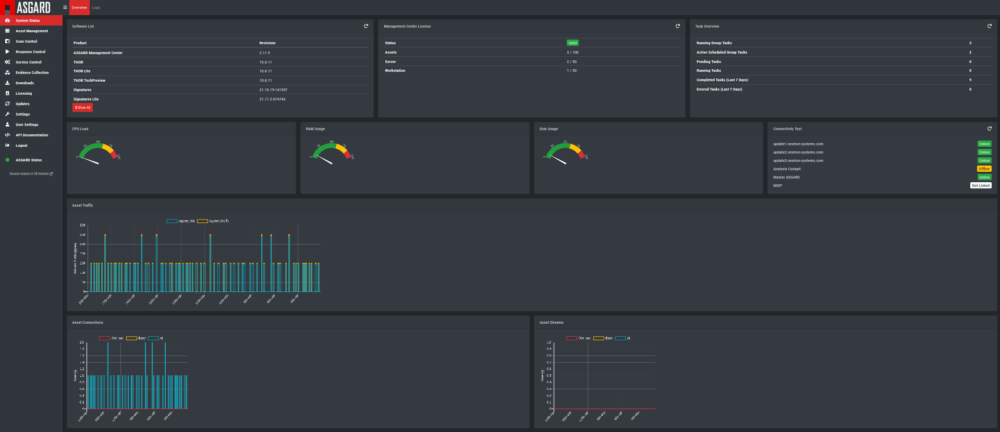
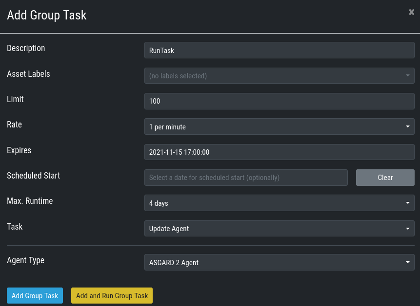

Advanced Configuration
======================

Performance Tuning
------------------

Overview
^^^^^^^^

The ASGARD agent polls the ASGARD server frequently for new tasks to execute. The default polling interval depends on the number of connected endpoints. In larger environments the polling interval increases dynamically up to 10 minutes for a configuration with 25.000 endpoints connected to a single ASGARD. 

Additionally, ASGARD is configured to serve a maximum of 100 concurrent asset connections and 25 concurrent asset streams. Asset connections are short polls from the agent such as answering the question "do you have a new task for me?". Asset streams are intense polls such as downloading THOR to the agent or uploading scan results back to ASGARD. 

Requests that exceed the limits will receive an answer from ASGARD to repeat the request after N seconds, where N is calculated based on the current load.

This factory preset behavior insures your ASGARD stays stable and responsive even if your ASGARD’s system resources are limited. Furthermore, you most likely can't overload your network or firewalls with high numbers of requests or downloads.

In order to modify ASGARDs performance settings edit ``/etc/nextron/asgard2/asgard.conf`` and restart the ASGARD service.

The default values are: 

================== ==============
Value              Description 
================== ==============
LoadConnMax=100    Max. concurrent „Busy Connections"
LoadStreamMax=25   Max. concurrent „Busy Streams"
PingRateMin=10     Polling Rate with 0 connected Assets (seconds)
PingRateMax=600    Polling Rate with 25000 connected Assets (seconds)
PingRateFast=5     Polling Rate for Assets in Fast Ping Mode (seconds)
================== ==============

These values should work fine in most scenarios – regardless of the size of the installation. However, you may want to decrease PingRateMax in order to achieve a better responsiveness of your ASGARD infrastructure. 

Overloading ASGARD
^^^^^^^^^^^^^^^^^^

While temporary stream overloads are quite normal, connection overloads should not happen. If they do, either adjust your PingRateMax, your LoadConnMax or both. 

ASGARD will indicate an overload with the "Connection Overload line" and the "Stream Overload line" within the graphs in the overview section (see picture below). If an ASGARD is in an overload situation it will postpone connections and streams but will not lose or drop tasks or be harmed in any way. ASGARD will recover to normal load automatically.

   Asset Connections and Asset Streams 

Stream overloads can happen temporarily (e.g. if you schedule a grouped scan or grouped task with an unlimited rate). The picture below shows such a normal overload situation that was caused by starting a grouped scan with an unlimited rate. This is the expected behavior. ASGARD will manage the load automatically and postpone streams until the load has returned to normal.

.. figure:: ../images/image95-1592778455357.png
   :target: ../_images/image95-1592778455357.png
   :alt: image95

   Asset Streams in an overload situation

The "Busy Streams" line indicates the number of streams currently active. As you might have guessed, the picture above was taken on an ASGARD in default configuration where the number of concurrent streams is set to the default value of 25.

Managing Logs
-------------

ASGARD will store all logs under ``/var/lib/nextron/asgard2/log``

All logs will be rotated monthly for up to 14 months and zipped after one month.

Please copy the oldest log packages to another directory or to a dedicated log server in case you require longer retention periods. **Do not modify the built-in rotation settings** as this might interfere with ASGARD updates!

Agent and Agent Installer Update
--------------------------------

When ASGARD has a new agent version available you can see an indicator on the ``Update`` menu item as well as on the sub menu ``Update`` > ``Agents``. There are two tasks to perform, updating the agents on your assets and updating the agent installer for all future asset deployments.

Agent Update
^^^^^^^^^^^^

If this is the first agent update performed on this ASGARD you might need to enable the ``Update Agent`` module under ``Settings`` > ``Advanced`` > ``Show Advanced Tasks``.

Then you need to run the ``Update Agent`` module. You can do this on a per asset basis by running a playbook from ``Asset Management`` or create a ``New Group Task`` from ``Response Control``, which is the preferred way. You can roll-out the update in batches by providing labels for each stage or not select any label to perform the update on all assets.

   Example Group Task for Agent Update

.. note::
   The ``Update Agent`` module is not shown by default under (Group) Tasks. To show the group task or single tasks (also inside the group task) you need to select the ``Update Agent`` module from the ``Module`` column. You may need to select the ``Module`` column from ``Column visibility`` first, if not shown.

Agent Installer Update
^^^^^^^^^^^^^^^^^^^^^^

You need to update the agent installer as well, so that newly added assets will directly use the current agent version. This is a manual task as you might have customized your installers. If this is the case you have to repack the agent installers as explained in :ref:`chapter 6.4 Creating Custom Agent Installer <usage/commandline:Creating Custom Agent Installer>`.

If you use the default installer without any modifications you can run the following command to update the agent installers:

.. code::

   sudo asgard2-repacker

Creating Custom Agent Installer
-------------------------------

ASGARD supports creation of custom installers. Custom installers can be configured in a way that agents show up with a preset label or with a preset proxy configuration.

In order to create your custom ASGARD agent, save the current agents stored in ``/var/lib/nextron/asgard2/installer/`` to a directory of your choosing and run ``sudo asgard2-repacker`` with one or more of the following flags:

``-labels string``

Add initial labels to clients comma separated list, e.g. ``[label1,label2,label3]``

``-proxies string``

Proxies to be used by agents comma separated list, e.g. ``[proxy1.nextron:3128,proxy2.nextron:3128]``

Example: In order to create an installer for servers that initially show up in ASGARD with the label ``SQL-Servers`` use:

``# sudo asgard2-repacker -label SQL-Servers``

Your newly generated agents will show up in ``/var/lib/nextron/asgard2/installer`` and will immediately be available for download from the login page. You can store multiple custom agents under ``/var/lib/nextron/asgard2/installer/``. In this case all agents will be available for download from ASGARDs login page.

You can obfuscate the default asgard2-agent name with a custom one. The chosen name will generate new agents which can be deployed to the endpoints. These agents will create a service with the chosen name and will have no reference to ASGARD.

``-name string``

E.g. ``sudo asgard2-repacker -name javax``

This command will create a new agent for all operating systems. This is specially designed for cases where an agent obfuscation is required.

An installed agent with the name "javax" would look like this:

.. code-block:: bash

   systemctl status javax
   javax.service
   Loaded: loaded (/etc/systemd/system/javax.service; enabled; vendor preset: enabled)
   Active: active (running) since Thu 2020-xx-xx 16:47:22 CET; 5s ago
   Main PID: 20048 (javax-service)
      Tasks: 7 (limit: 4915)
   Memory: 4.7M
   CGroup: /system.slice/javax.service
           20048 /usr/sbin/javax-serviceMar 26 16:47:22 asgard2-dev systemd[1]: Started javax.service.

Admin User Password Reset 
-------------------------

If you've lost the password of the local ``admin`` user (Web GUI) but still have access the system via SSH, you can reset it via command line using the following command. 

.. code-block:: bash 

   sudo mysql asgard -e "UPDATE users SET password = 'YmIc6P_6jdbeEL0HY4xIcpYstmM' WHERE name = 'admin';"

This resets the password to ``admin``. You should then change that password immediately. 

Backup and Restore
------------------

Backup
^^^^^^
The command ``asgard-backup`` can be used to generate a backup of all configurations, assets, tags, user accounts, tasks etc. except:

* Log files (ASGARD, THOR)
* Playbook results (collected evidence)
* Quarantined samples (Bifrost)

.. code:: bash 

   $ asgard2-backup
   Writing backup to '/var/lib/nextron/asgard2/backups/20200427-1553.tar'
   tar: Removing leading '/' from member names
   tar: Removing leading '/' from hard link targets
   Removing old backups (keeping the 5 most recent files)...
   done.

Restore
^^^^^^^

You can use the ``asgard-restore`` command to restore a backup.

.. code:: bash

   $ asgard2-restore``
   Usage: /usr/sbin/asgard2-restore <BACKUPFILE>
   $ asgard2-restore`` ``/var/lib/nextron/asgard2/backups/20200427-1553.tar
   Stopping services... Removed /etc/systemd/system/multi-user.target.wants/asgard2.service.
   done.
   etc/nextron/asgard2/
   etc/nextron/asgard2/upgrade2.sh
   etc/nextron/asgard2/run_asgard2.sh
   etc/nextron/asgard2/server.pem
   etc/nextron/asgard2/ca2.key
   etc/nextron/asgard2/pre_asgard2.sh
   etc/nextron/asgard2/rsyslog-asgard-audit.conf
   etc/nextron/asgard2/client.yaml
   ...
   1+0 records in
   1+0 records out
   24 bytes copied, 3.2337e-05 s, 742 kB/s
   Starting services... Created symlink /etc/systemd/system/multi-user.target.wants/asgard2.service → lib/systemd/system/asgard2.service. done.

Disable Remote Console Globally
-------------------------------
Remote Console on connected endpoints can be disabled centrally by creating the following file. 

.. code:: bash

   $ sudo touch /etc/nextron/asgard2/disable_console

To reenable Remote Console simply remove the created file

.. code:: bash

   $ sudo rm /etc/nextron/asgard2/disable_console

