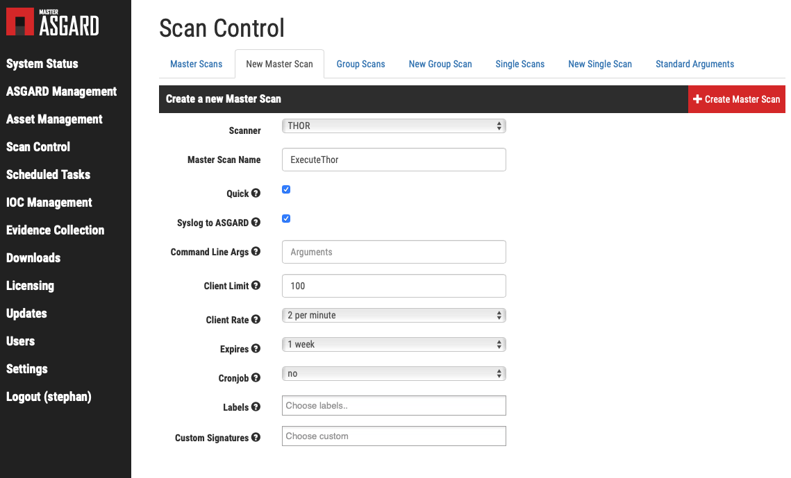
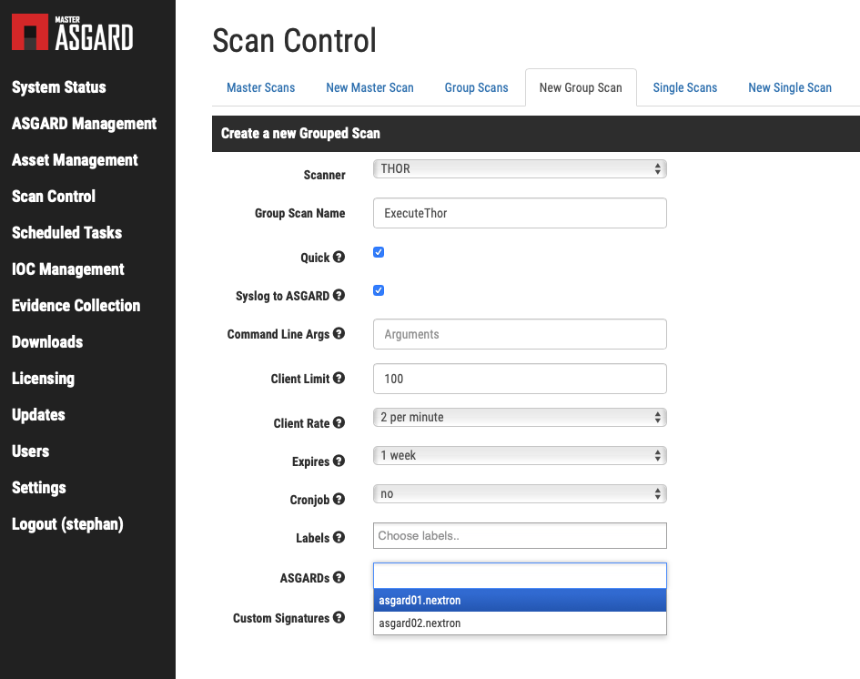

Manage ASGARD Using MASTER ASGARD
=================================

MASTER ASGARD is a single central management console that can control all of your ASGARD systems. It is meant to manage centrally controlled scans on all your ASGARD systems with just one click. MASTER ASGARD also provides one central point of management for your IOCs. 

The local IOC Management on an ASGARD system will become inactive when connected to a MASTER ASGARD. Instead, all IOCs on the MASTER ASGARD will sync down to the subordinate ASGARD. 

From then on, ASGARD will only use the central IOCs stored and managed on MASTER ASGARD. Additionally, the licensing section on ASGARD will become inactive and the local ASGARD license will be replaced by the MASTER ASGARD license. Every ASGARD can issue scanning licenses to assets as long as the total number of scanned servers and workstations does not exceed the number of systems in the master license.

On MASTER ASGARD, all functions are relatively similar to use compared to ASGARD. You can select and label your assets in the ``Asset Management`` section, manage your users in the "Users" section, add your licenses in the ``Licensing`` section. Evidence collection is started in the asset view and results show up in the ``Evidence Collection`` section. 

However, there are some important changes and additions to certain functions in order to support central control.

Hardware Requirements for MASTER ASGARD
---------------------------------------

MASTER ASGARD has the following hardware requirements.

=================== =======
Component           Value
=================== =======
System memory       16 GB
Hard disk           1 TB 
CPU Cores           4
=================== =======

Setting up MASTER ASGARD
------------------------

The setup procedure for MASTER ASGARD is identical to the setup procedure for ASGARD Management Center. However, the default credentials differ. 

On the Web based GUI
^^^^^^^^^^^^^^^^^^^^

User: ``admin``
Password: ``masterasgard-admin!`` 

On the Console
^^^^^^^^^^^^^^

User: ``nextron`` 
Password: ``masterNextron2019``

Scan control in MASTER ASGARD
-----------------------------

Create a Master Scan
^^^^^^^^^^^^^^^^^^^^

A "Master Scan" is a scan that runs on all ASGARDS. In order to create a master scan, navigate to the ``New Master Scan`` tab, fill out the values that you need and click the ``Create Master Scan`` button. Please note, this only defines the Master Scan. You can start the scan in the ``Master Scan`` tab of this section. 

You can limit the number of assets by using labels. Please note, the ``Client Rate`` value is pushed down to every ASGARD. If you use a client rate of 5 and push the scan to 10 ASGARDs you will end up with a total client rate of 50.  

If the checkbox ``syslog to ASGARD`` is marked, all endpoints will send their scan results to the respective ASGARD they are connected to. MASTER ASGARD is not designed to receive syslog messages. 

   Create a Master Scan

Create a Grouped Scan
^^^^^^^^^^^^^^^^^^^^^

While a Master Scan is always pushed to all connected ASGARDs, a Grouped Scan gives you the opportunity to select a subset of ASGARDS where you want the scan to run. 

In order to create a new grouped scan, click the ``New Grouped Scan`` tab, fill out the values that you need and click the ``Create Grouped Scan`` button. Please note, this only defines the Grouped Scan. You can start the scan in the ``Grouped Scan`` tab of this section. 

You must select at least one ASGARD in order to define the scan. Please note, the ``Client Rate`` value is pushed down to every ASGARD. If you use a client rate of 5 and push the scan to 10 ASGARDs you will have a total client rate of 50. 

If the checkbox ``syslog to ASGARD`` is marked, all endpoints will send their scan results to the respective ASGARD they are connected to. MASTER ASGARD is not designed to receive syslog messages. 

   Create a Grouped Scan on MASTER ASGARD

User roles in Master ASGARD
^^^^^^^^^^^^^^^^^^^^^^^^^^^

Master ASGARDs user roles are not as granular as role management in ASGARD 2. However, there is a set of permissions to define the level of privileges that can be granted to a user. 

The permissions are defined as follows.

Admin
"""""
Unrestricted

Evidence Collection
"""""""""""""""""""
Users with this permission are able to access the "Response Control Section" and collect evidence such as files and memory dumps. They may also create and start scans.

Advanced Scan Control
"""""""""""""""""""""
Users with this permission are able to overwrite the standard arguments for all scans, may use restricted scan templates and may use ``Evidence Collection``. They can also create and start scans.

Manage Scan Templates
"""""""""""""""""""""
Users with this permission are able to manage scan templates. They can also create and start scans.

Force Standard Args
"""""""""""""""""""
Users with this permission are able to create and start scans only with predefined standard arguments or scan templates that are not restricted.
