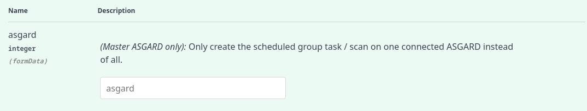

MASTER ASGARD
=============

MASTER ASGARD is a single central management console that can control all of your ASGARD systems. It is meant to centrally manage controlled scans on all your ASGARD systems. MASTER ASGARD also provides one central point of management for your Response Playbooks, Evidence Collection and IOC Management. 

Since MASTER ASGARD version 2, you install a MASTER ASGARD by promoting a bare ASGARD system with the installation of a special license. After the MASTER ASGARD license installation many functions offer additional options. However from that moment onwards, your MASTER ASGARD controls all endpoints connected to all linked ASGARD systems. 

Hardware Requirements for MASTER ASGARD
---------------------------------------

MASTER ASGARD has the following hardware requirements:

.. list-table::
   :header-rows: 1
   :widths: 50, 50

   * - Component
     - Value
   * - System Memory
     - 16 GB
   * - Hard Disk
     - 1 TB
   * - CPU Cores
     - 8

License Management
------------------

Once you connect ASGARD systems with MASTER ASGARD, the licensing sections on connected ASGARD systems become inactive. The local ASGARD license will be replaced with the MASTER ASGARD license. Every ASGARD can issue scanning licenses to assets as long as the total number of scanned servers and workstations does not exceed the number of systems in the master license.

Setting up MASTER ASGARD
------------------------

The setup procedure for MASTER ASGARD is identical to the setup procedure for ASGARD Management Center. 
Since MASTER ASGARD v2, you install an ASGARD v2 and promote it to MASTER ASGARD v2 through a special license upload.

.. note::
   After upgrading an ASGARD to a MASTER ASGARRD, all previous information and settings on that system will be lost. Don't upgrade ASGARD systems with connected endpoints, but only newly installed systems. 

Default Credentials
^^^^^^^^^^^^^^^^^^^

.. list-table::
   :header-rows: 1
   :widths: 25, 25, 50

   * - Interface
     - Username
     - Password
   * - Web UI
     - admin
     - admin
   * - CLI/SSH
     - nextron
     - `manually set during system installation`

Link ASGARD Systems with MASTER ASGARD 
--------------------------------------

On your ASGARD server, got to ``Settings`` > ``MASTER ASGARD``, generate a one-time code and copy it. 

.. figure:: ../images/link-master1.png
   :target: ../_images/link-master1.png
   :alt: Generate One Time Token

   Generate One Time Token on ASGARD

In MASTER ASGARD go to ``Connected ASGARDs``, click the ``Add ASGARD`` button in the upper right and use the hostname and one-time token to connect that ASGARD system. You can use a description to provide more information on that ASGARD server, e.g. ``DMZ 1`` or ``Region EMEA - HQ 1``. 

.. figure:: ../images/link-asgard-in-master-asgard.png
   :target: ../_images/link-asgard-in-master-asgard.png
   :alt: Link ASGARD in MASTER ASGARD

   Link ASGARD in MASTER ASGARD

.. note::
   You don't have to provide a port in the hostname field. Don't use a URL like ``https://`` but just the FQDN. Remember that MASTER ASGARD must be able to reach ASGARD v2 systems on port 5443/tcp and ASGARD v1 systems on port 9443/tcp. Also make sure that the MASTER ASGARD system is able to resolve the hostname of the ASGARD system. 

Scan Control
------------

Scan Control in MASTER ASGARD looks the same as in an ASGARD server. The only difference is that you can select an ASGARD Server or "All ASGARDs" to run the scans on.  

.. figure:: ../images/scan-control-in-master-asgard-add-group-task.png
   :target: ../_images/scan-control-in-master-asgard-add-group-task.png
   :alt: MASTER ASGARD Scan Control

   Scan Control in MASTER ASGARD - Add Group Task

Asset Management
----------------

Asset Management in MASTER ASGARD is very similar to the asset management in ASGARD. 

The only differences are:

* ASGARD column shows to which ASGARD system the endpoint is connected
* Only CSV export is allow (asset labeling via CSV import is unavailable)

IOC Management
--------------

On MASTER ASGARD you can manage IOCs exactly like on ASGARD. The only limitation is that IOCs in MASTER ASGARD and ASGARD are isolated. That means if you want to use the IOCs from MASTER ASGARD, you need to initiate the scan from MASTER ASGARD and if you want to use the IOCs from ASGARD, you need to initiate the scan from ASGARD. In general we suggest to manage IOCs in MASTER ASGARD for maximum flexibility.

Service Control
---------------

Service Control lists the asset with an installed service controller. An asset is either managed by MASTER ASGARD or its connected ASGARD, not by both. If an asset is managed by MASTER ASGARD it can still be viewed by the connected ASGARD (and vice versa). If MASTER ASGARD or ASGARD edits a configuration of an asset it will take over the "leadership" over this asset, no matter by which it was managed beforehand.

.. figure:: ../images/master-service-controller.png
   :target: ../_images/master-service-controller.png
   :alt: Example: Service Controller listed in ASGARD but managed by MASTER ASGARD

   Example: Service Controller listed in ASGARD but managed by MASTER ASGARD

Evidence Collection 
-------------------

All collected evidence is available in MASTER ASGARD's ``Evidence Collection`` section. 

Download Section 
----------------

The ``Downloads`` section of MASTER ASGARD doesn't contain scanner packages since the scanners get downloaded and maintained on each of the connected ASGARD servers only. 

Updates
-------

The ``Updates`` section contains a tab in which upgrades for ASGARD can be installed. 

A third tab named ``THOR and Signatures`` gives you an overview of the used scanner and signature versions on all connected ASGARDs. 

.. figure:: ../images/master-asgard-scanner-updates.png
   :target: ../_images/master-asgard-scanner-updates.png
   :alt: MASTER ASGARD Scanner Updates

   MASTER ASGARD Scanner Updates

It is possible to set a certain THOR and Signatures version for each connected ASGARD. However, if automatic updates is configured, this setting has only effect until a new version gets downloaded. 

Customers use this feature in cases in which they want to test a certain THOR version before using it in production. In this use case the ASGARD system that runs the test scans is set to automatic updates, while the ASGARD systems in production use versions that administrators set manually after successful test runs. 

User Management
---------------

MASTER ASGARD offers no central user and role management for all connected ASGARD servers. Since MASTER ASGARD and ASGARD allow to use LDAP for authentication, we believe that complex and centralised user management should be based on LDAP.

MASTER ASGARD and Analysis Cockpit
----------------------------------

It is not possible to link MASTER ASGARD with an Analysis Cockpit and transmit all scan logs via MASTER ASGARD to a single Analysis Cockpit instance. Each ASGARD has to deliver its logs separately to a connected Analysis Cockpit.

MASTER ASGARD API
-----------------

The MASTER ASGARD API is documented in the ``API Documentation`` section and resembles the API in ASGARD systems. 

However, many API endpoints contain a field in which users select the corresponding ASGARD (via ``ID``) or all ASGARDs (``ID=0``) 

   MASTER ASGARD API Peculiarity
