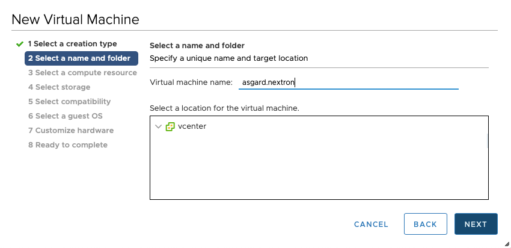
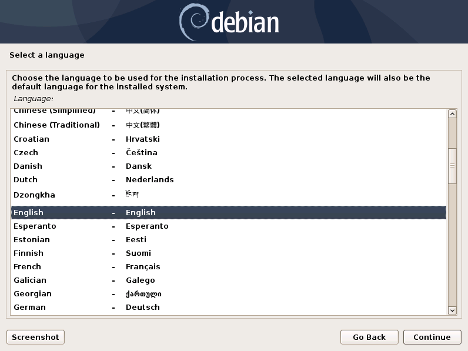
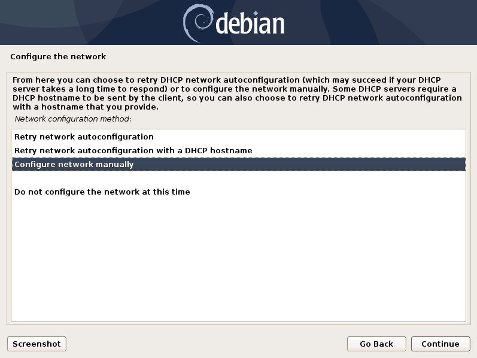
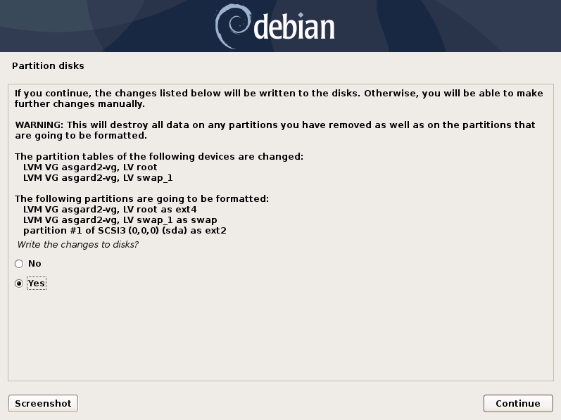
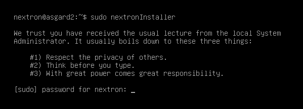
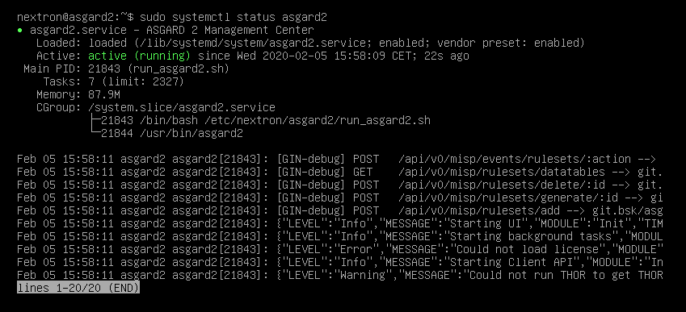
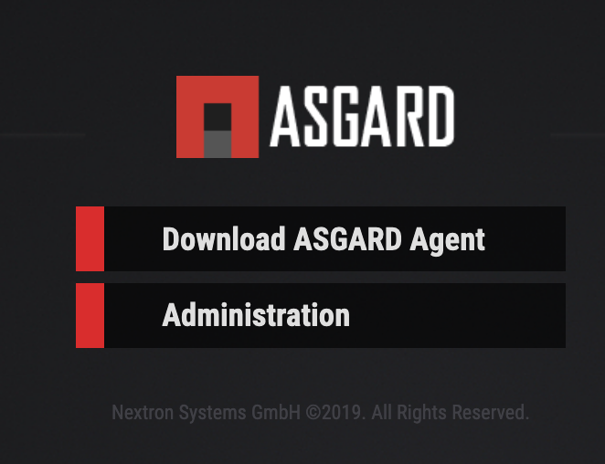
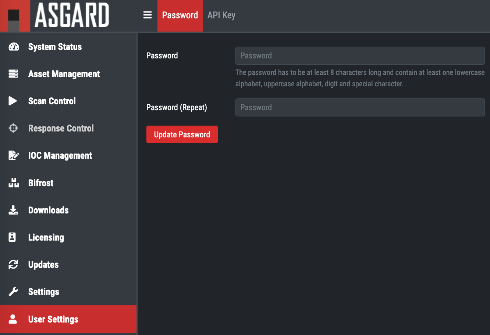

Quick Setup Guide
=================

Setup a New ESX VM and Mount the ISO
------------------------------------

Create a new VM with your virtualization software. In this case, we will use VMWare ESX managed through a VMWare VCenter.

The new VM must be configured with a Linux base system and Debian GNU/Linux 10 (64 bits) as target version. It is recommended to upload the ASGARD or Master ASGARD ISO to an accessible datastore and mount the same to your newly created VM. 

.. figure:: ../images/image4.png
   :target: ../images/image4.png
   :alt: image-20200605124008881

.. figure:: ../images/image7.png
   :target: ../images/image7.png
   :alt: image-20200605124044071

Please make sure to select a suitable v-switch or physical interface that reflects the IP address scheme you are planning to use for the new ASGARD.s

Navigate through the installer
------------------------------

The installation Process is started by clicking on ASGARD Graphical install. The installer then loads the additional components from the ISO and lets you select location and language.

.. figure:: ../images/image8.png
   :target: ../images/image8.png
   :alt: image-20200608150437765

.. figure:: ../images/image10.png
   :target: ../images/image10.png
   :alt: image-20200608150457886

.. figure:: ../images/image11.png
   :target: ../images/image11.png
   :alt: image-20200608150508675

.. figure:: ../images/image12.png
   :target: ../images/image12.png
   :alt: image-20200608150516258

If DHCP is available, network parameters will be configured automatically. Without DHCP, ASGARD drops into the manual network configuration dialogue. 

.. figure:: ../images/image13.png
   :target: ../images/image13.png
   :alt: image-20200608150610344

.. figure:: ../images/image15.png
   :target: ../images/image15.png
   :alt: image-20200608150627306

.. figure:: ../images/image16.png
   :target: ../images/image16.png
   :alt: image-20200608150635494

.. figure:: ../images/image17.png
   :target: ../images/image17.png
   :alt: image-20200608150643829

.. figure:: ../images/image18.png
   :target: ../images/image18.png
   :alt: image-20200608150649677

   **Important:** Make sure that the combination of hostname and domain creates an FQDN that can be resolved from the endsystems on which you intend to install the ASGARD agents. If you've configured a FQDN (hostname + domain) that cannot be resolved on the clients, no agent will be able to find and reconnect to the ASGARD server. 

.. figure:: ../images/image19.png
   :target: ../images/image19.png
   :alt: image-20200608150655947

.. figure:: ../images/image20.png
   :target: ../images/image20.png
   :alt: image-20200608150703290

Finally, write your configuration to the disk by selecting "Yes" and clicking "Continue".

If you are using a proxy to access the internet, enter the proxy details in the next step. Please note, **Internet connectivity is required** for the next step – the installation of the ASGARD service. 

.. figure:: ../images/image22.png
   :target: ../images/image22.png
   :alt: image-20200608150727269

The base installation is now complete. In the next step we’ll install the ASGARD service. For this step **Internet connectivity is required**.

SSH to the appliance using the user: ``nextron`` and password: ``nextron`` and type 

``sudo nextronInstaller`` (caution: upper case “i" in the middle). This will install ASGARD.

After installation is complete type ``sudo systemctl status asgard2``. 

The output should look like the screenshot below with status ``Active``.

Installation is complete, you are ready to log into the web-based GUI.

Change IP Address
-----------------

ASGARD’s IP can be changed in **/etc/network/interfaces**. The IP is configured with the address variable.

.. code:: bash

   nextron@asgard:~$ sudo vi /etc/network/interfaces

   auto ens32
   iface ens32 inet static
   address 192.0.2.7
   netmask 255.255.255.0
   gateway 192.0.2.254

Important: There might be a case where the name of the network adaptor (in this example: ``ens32``) can vary.

First steps in the VM
---------------------

Change Password at the Command Line
^^^^^^^^^^^^^^^^^^^^^^^^^^^^^^^^^^^

Login to ASGARD and type passwd in order to change the password for the default user ``nextron``. The default password is ``nextron``.

Change Password for the web-based Interface
^^^^^^^^^^^^^^^^^^^^^^^^^^^^^^^^^^^^^^^^^^^

Login to the ASGARD Web interface with user ``admin`` and password ``admin``.

The admin user has limited/restricted access to some sections to ensure the correct audit of certain actions. In order to access restricted functions which require an audit please create an user with the corresponding rights under ``Settings`` > ``Users``.

   Login Screen

Click on ``User Settings`` and update your password. 

   Changing the Password