Setup Guide
===========

Create a new ESX VM and Mount the ISO
-------------------------------------

Create a new VM with your virtualization software. In this case, we will use VMWare ESX managed through a VMWare VCenter.

The new VM must be configured with a Linux base system and Debian GNU/Linux 10 (64 bits) as target version. It is recommended to upload the ASGARD or MASTER ASGARD ISO to an accessible data store and mount the same to your newly created VM. 

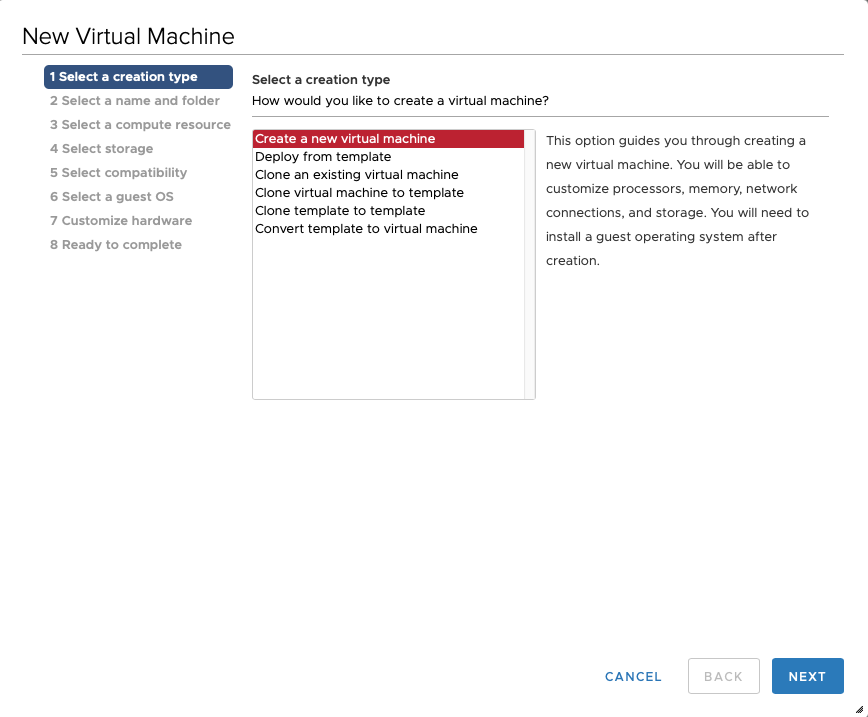

.. figure:: ../images/setup_esx2.png
   :alt: New Virtual Machine - ESX

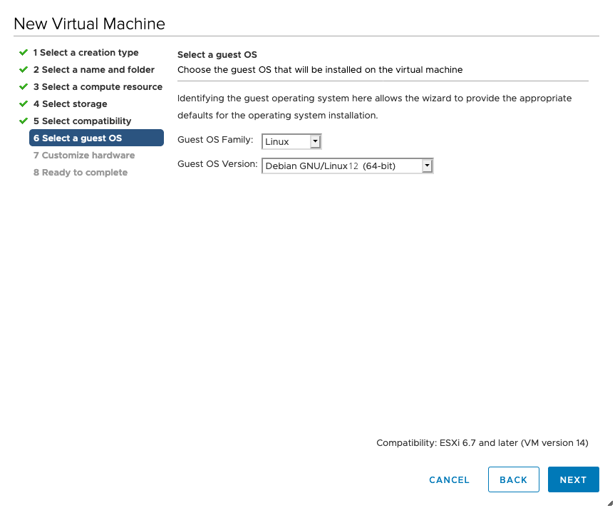

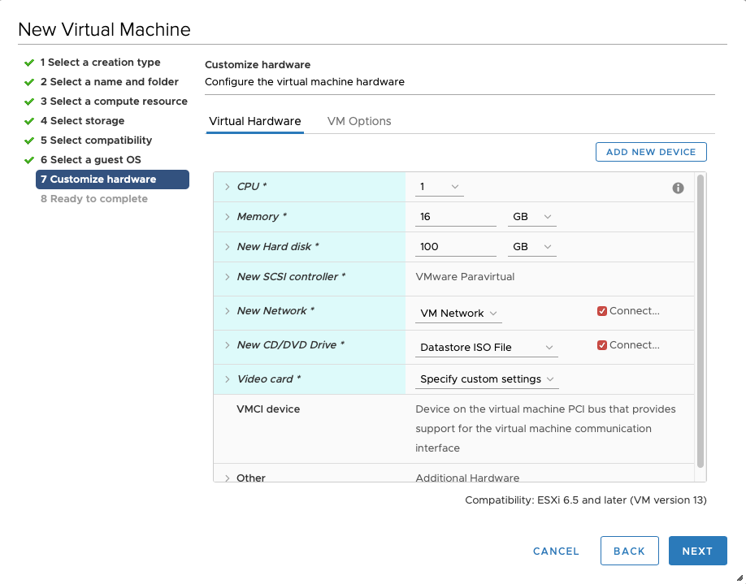

Please make sure to select a suitable v-switch or physical interface that
reflects the IP address scheme you are planning to use for the new ASGARD.
Only use one Hard Disk for the installation.

Navigate through the installer
------------------------------

The installation Process is started by clicking on ASGARD Graphical install.
The installer then loads the additional components from the ISO and lets you select location and language.

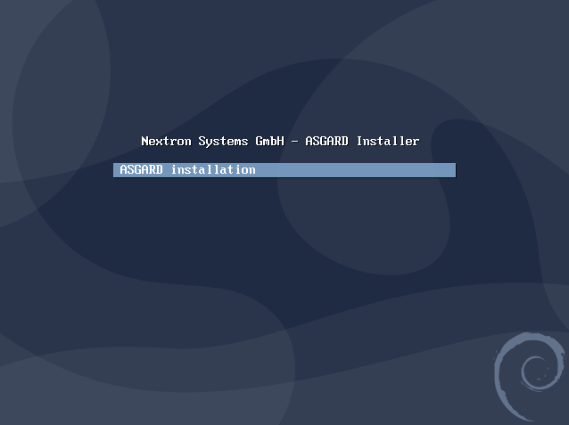

.. figure:: ../images/setup_language.png
   :alt: Select a language

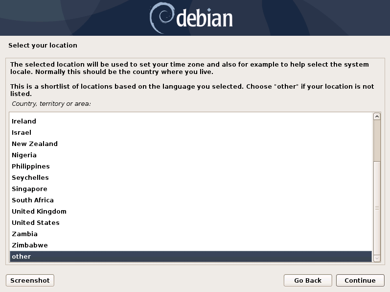

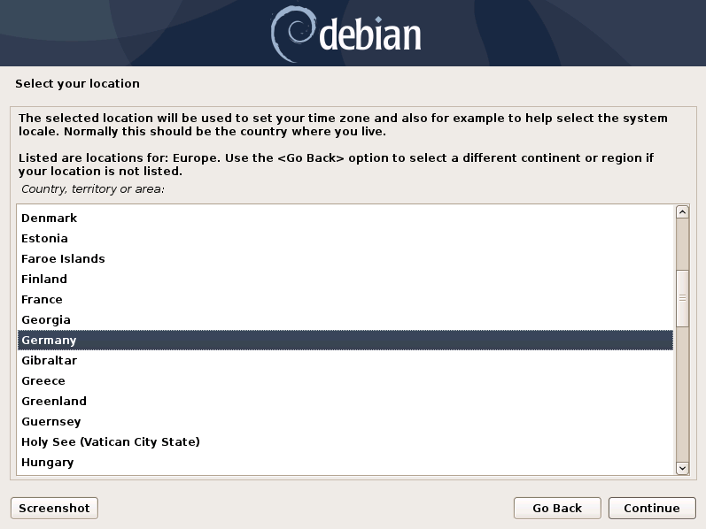

.. warning::
   Please make sure to select the correct Country, as this will also set your local timezone!

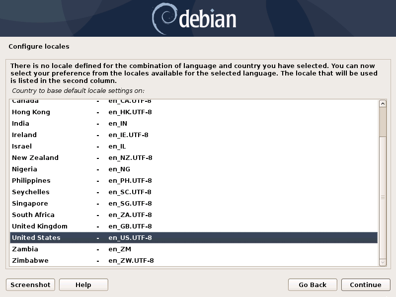

If DHCP is available, network parameters will be configured automatically.
Without DHCP, ASGARD drops into the manual network configuration dialogue. 

Without DHCP, ASGARD proceeds with the manual network configuration dialogue.

Network Configuration
---------------------

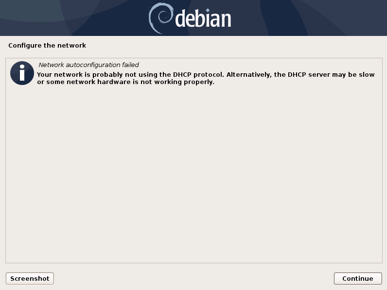

.. figure:: ../images/setup_network2.png
   :alt: Configure the network

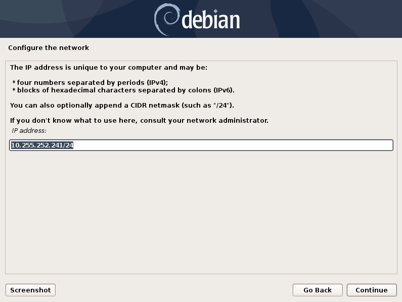

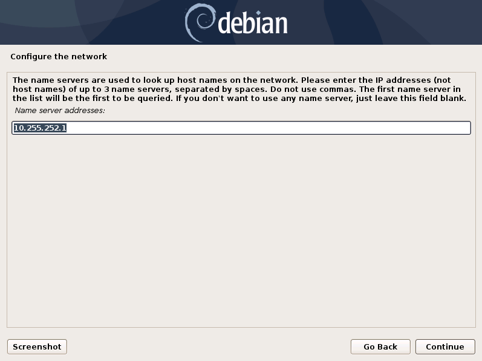

.. warning::
   ASGARD needs to be able to resolve internal and external IP addresses.

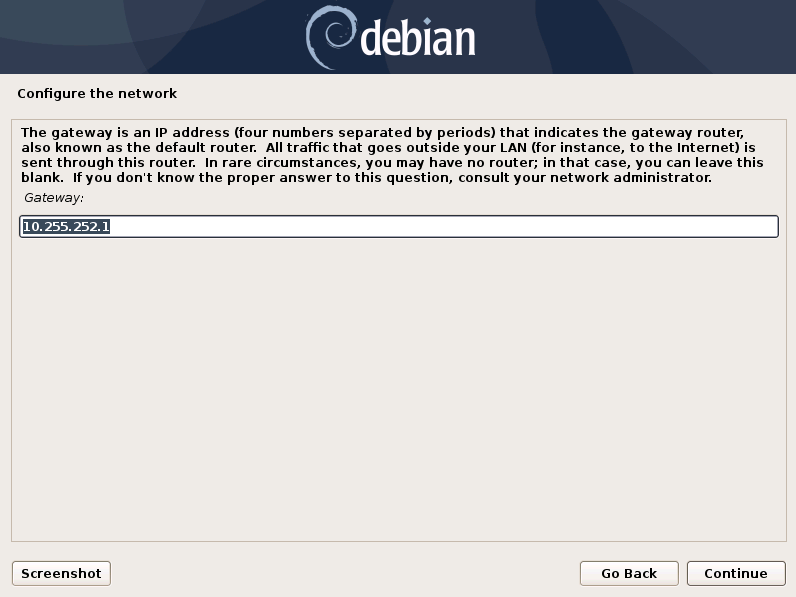

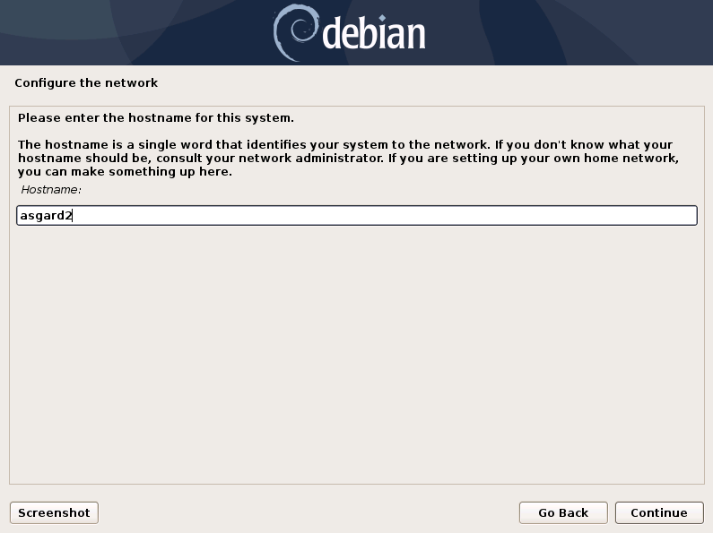

.. important::
   **Important:** Make sure that the combination of hostname and domain
   creates an FQDN that can be resolved from the endpoints on which you
   intend to install the ASGARD agents. If you've configured a FQDN (hostname +
   domain) that cannot be resolved on the clients, no agent will be able
   to find and reconnect to the ASGARD server.

   This is especially important since your Management Center will create
   some certificates during the installation, which will not contain an
   IP Address as its Subject Alternative Name (SAN), but only the FQDN!
   You will not be able to connect your ASGARD Management Center with
   your Analysis Cockpit via IP Address.

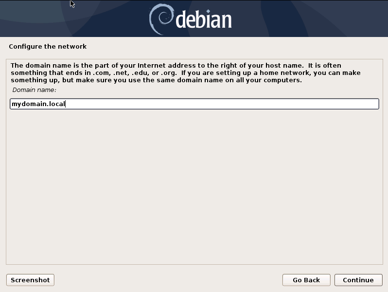

Choosing a password
-------------------

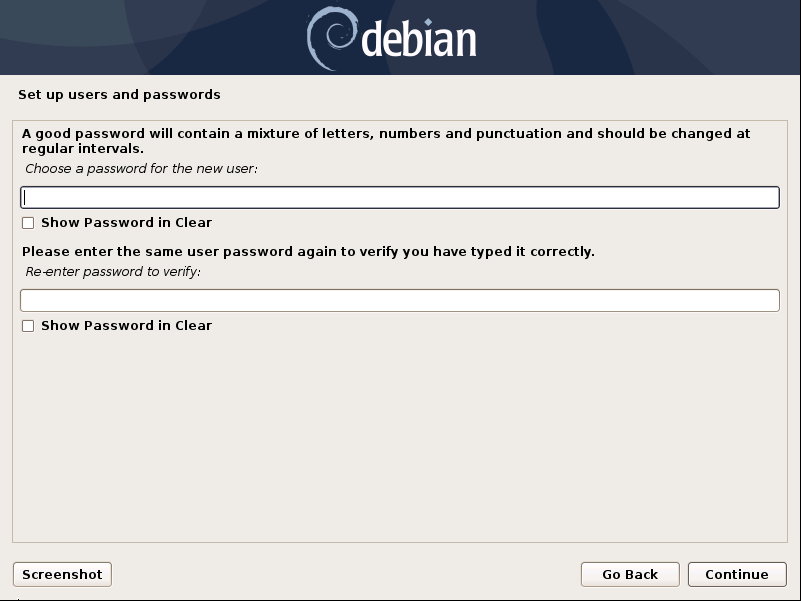

   Choosing a password for the ``nextron`` user

Partitioning the Hard Disk
--------------------------

.. warning:: 
   ASGARD is intended to be installed with only one disk.
   Do not configure your server with multiple disks.
   The system won't configure additional disks. Make sure
   that your disk has the recommended size. See
   :ref:`usage/requirements:hardware requirements`
   for more information.

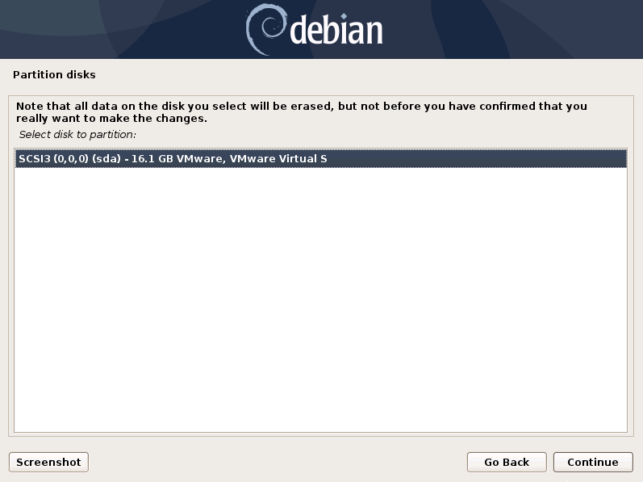

Finally, write your configuration to the disk by selecting "Yes" and clicking "Continue".

.. figure:: ../images/setup_disks2.png
   :alt: Partition disks

Proxy Configuration
-------------------

If you are using a proxy to access the internet, enter the proxy details in the next step.
Please note, ``Internet connectivity is required`` for the next step – the installation of the ASGARD service. 

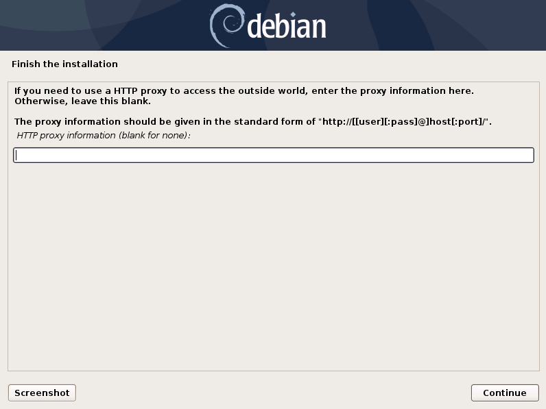

The base installation is now complete. In the next step we will install the ASGARD service.
For this step ``Internet connectivity is required``.

Install the ASGARD Management Center Services
---------------------------------------------

Use SSH to connect to the appliance using the user ``nextron`` and the password you
specified during the installation (if you were using an old ISO to install the base
system, the password is ``nextron``). Now you can run the following command: 

``sudo nextronInstaller -asgard`` (caution: upper case “i" in the middle). This will install ASGARD.

.. figure:: ../images/setup_nextronInstaller.png
   :alt: running the nextronInstaller

After installation is complete type ``sudo systemctl status asgard2``. 

The output should look like the screenshot below with status ``Active``.

.. figure:: ../images/setup_service.png
   :alt: systemctl status asgard2

Installation is complete, you are ready to log into the web-based GUI.

Changing the IP-Address
-----------------------

ASGARD's IP-Address can be changed in **/etc/network/interfaces**. The IP is configured with the address variable.

.. code-block:: console

   nextron@asgard:~$ sudo vi /etc/network/interfaces

.. code-block:: none

   auto ens32
   iface ens32 inet static
   address 192.0.2.7
   netmask 255.255.255.0
   gateway 192.0.2.254

Important: There might be a case where the name of the network adaptor (in this example: ``ens32``) can vary.

The new IP can be applied with the command **sudo systemctl restart networking**

Verifying DNS Settings
^^^^^^^^^^^^^^^^^^^^^^

To verify if ASGARD is using the correct DNS Server, you can inspect the file ``/etc/resolv.conf``:

.. code-block:: console

   nextron@asgard:~$ cat /etc/resolv.conf 
   search example.org
   nameserver 172.16.200.2

If you see errors in this configuration, you can change it with the following command:

.. code-block:: console

   nextron@asgard:~$ sudoedit /etc/resolv.conf

First steps in the VM
---------------------

Change the Command Line Password
^^^^^^^^^^^^^^^^^^^^^^^^^^^^^^^^

Login to ASGARD and type ``passwd`` in order to change the password for the default
user ``nextron``. The default password is ``nextron``.

.. warning::
   This step is not necessary if you used the new installer ISO, since the password
   will be already set during installation (see :ref:`usage/setup:choosing a password`)

Change the Web Password
^^^^^^^^^^^^^^^^^^^^^^^

Login to the ASGARD Web interface with user ``admin`` and password ``admin``.

The admin user has limited/restricted access to some sections to ensure the correct
audit of certain actions. In order to access restricted functions which require an
audit please create an user with the corresponding rights under ``Settings`` > ``Users``.

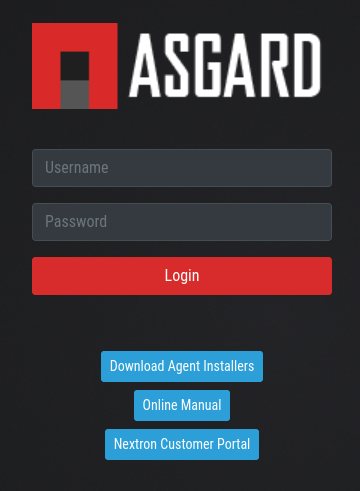

   Login Screen

Click on ``User Settings`` and update your password. 

.. figure:: ../images/changing-the-password.png
   :alt: Changing the Password

   Changing the Password
