Quick Setup Guide
=================

Setup a New ESX VM and Mount the ISO
------------------------------------

Create a new VM with your virtualization software. In this case, we will use VMWare ESX managed through a VMWare VCenter.

The new VM must be configured with a Linux base system and Debian GNU/Linux 10 (64 bits) as target version. It is recommended to upload the ASGARD or MASTER ASGARD ISO to an accessible data store and mount the same to your newly created VM. 

.. figure:: ../images/setup_esx1.png
   :target: ../images/setup_esx1.png
   :alt: New Virtual Machine - ESX

.. figure:: ../images/setup_esx2.png
   :target: ../images/setup_esx2.png
   :alt: New Virtual Machine - ESX

.. figure:: ../images/setup_esx3.png
   :target: ../images/setup_esx3.png
   :alt: New Virtual Machine - ESX

.. figure:: ../images/setup_esx4.png
   :target: ../images/setup_esx4.png
   :alt: New Virtual Machine - ESX

Please make sure to select a suitable v-switch or physical interface that reflects the IP address scheme you are planning to use for the new ASGARD.

Navigate through the installer
------------------------------

The installation Process is started by clicking on ASGARD Graphical install. The installer then loads the additional components from the ISO and lets you select location and language.

.. figure:: ../images/setup_iso_installer.png
   :target: ../images/setup_iso_installer.png
   :alt: ISO Installer - ASGARD

.. figure:: ../images/setup_language.png
   :target: ../images/setup_language.png
   :alt: Select a language

.. figure:: ../images/setup_location1.png
   :target: ../images/setup_location1.png
   :alt: Select your location

.. figure:: ../images/setup_location2.png
   :target: ../images/setup_location2.png
   :alt: Select your location

.. warning::
   Please make sure to select the correct Country, as this will also set your local timezone!

.. figure:: ../images/setup_locales.png
   :target: ../images/setup_locales.png
   :alt: Configure locales

If DHCP is available, network parameters will be configured automatically. Without DHCP, ASGARD drops into the manual network configuration dialogue. 

.. figure:: ../images/setup_network1.png
   :target: ../images/setup_network1.png
   :alt: Configure the network

.. figure:: ../images/setup_network2.png
   :target: ../images/setup_network2.png
   :alt: Configure the network

.. figure:: ../images/setup_network3.png
   :target: ../images/setup_network3.png
   :alt: Configure the network

.. figure:: ../images/setup_network4.png
   :target: ../images/setup_network4.png
   :alt: Configure the network

.. warning::
   ASGARD needs to be able to resolve internal and external IP addresses.

.. figure:: ../images/setup_network5.png
   :target: ../images/setup_network5.png
   :alt: Configure the network

.. figure:: ../images/setup_network6.png
   :target: ../images/setup_network6.png
   :alt: Configure the network

.. warning::
   **Important:** Make sure that the combination of hostname and domain creates an FQDN that can be resolved from the endsystems on which you intend to install the ASGARD agents. If you've configured a FQDN (hostname + domain) that cannot be resolved on the clients, no agent will be able to find and reconnect to the ASGARD server. 

.. figure:: ../images/setup_network7.png
   :target: ../images/setup_network7.png
   :alt: Configure the network

.. figure:: ../images/setup_password.png
   :target: ../images/setup_password.png
   :alt: Set up users and passwords

.. figure:: ../images/setup_disks1.png
   :target: ../images/setup_disks1.png
   :alt: Partition disks

Finally, write your configuration to the disk by selecting "Yes" and clicking "Continue".

.. figure:: ../images/setup_disks2.png
   :target: ../images/setup_disks2.png
   :alt: Partition disks

If you are using a proxy to access the internet, enter the proxy details in the next step. Please note, **Internet connectivity is required** for the next step – the installation of the ASGARD service. 

.. figure:: ../images/setup_proxy.png
   :target: ../images/setup_proxy.png
   :alt: Finish the installation

The base installation is now complete. In the next step we’ll install the ASGARD service. For this step **Internet connectivity is required**.

Use SSH to connect to the appliance using the user ``nextron`` and the password you specified during the installation (if you were using an old ISO to install the base system, the password is ``nextron``). Now you can run the following command: 

``sudo nextronInstaller -asgard`` (caution: upper case “i" in the middle). This will install ASGARD.

.. figure:: ../images/setup_nextronInstaller.png
   :target: ../images/setup_nextronInstaller.png
   :alt: running the nextronInstaller

After installation is complete type ``sudo systemctl status asgard2``. 

The output should look like the screenshot below with status ``Active``.

.. figure:: ../images/setup_service.png
   :target: ../images/setup_service.png
   :alt: systemctl status asgard2

Installation is complete, you are ready to log into the web-based GUI.

Change IP Address
-----------------

ASGARD's IP can be changed in **/etc/network/interfaces**. The IP is configured with the address variable.

.. code:: bash

   nextron@asgard:~$ sudo vi /etc/network/interfaces

   auto ens32
   iface ens32 inet static
   address 192.0.2.7
   netmask 255.255.255.0
   gateway 192.0.2.254

Important: There might be a case where the name of the network adaptor (in this example: ``ens32``) can vary.

The new IP can be applied with the command **sudo systemctl restart networking**

First steps in the VM
---------------------

Change Password at the Command Line
^^^^^^^^^^^^^^^^^^^^^^^^^^^^^^^^^^^

Login to ASGARD and type ``passwd`` in order to change the password for the default user ``nextron``. The default password is ``nextron``.

.. warning::
   This step is not necessary if you used the new installer ISO, since the password will be already set during installation.

Change Password for the web-based Interface
^^^^^^^^^^^^^^^^^^^^^^^^^^^^^^^^^^^^^^^^^^^

Login to the ASGARD Web interface with user ``admin`` and password ``admin``.

The admin user has limited/restricted access to some sections to ensure the correct audit of certain actions. In order to access restricted functions which require an audit please create an user with the corresponding rights under ``Settings`` > ``Users``.

.. figure:: ../images/login-screen.png
   :target: ../images/login-screen.png
   :alt: Login Screen

   Login Screen

Click on ``User Settings`` and update your password. 

.. figure:: ../images/changing-the-password.png
   :target: ../images/changing-the-password.png
   :alt: Changing the Password

   Changing the Password

Installing the Broker Network
-----------------------------

Beginning from the Version 2.14.0 of the ASGARD Management Center, you can install a Broker Network in your environment (a special license is needed for this feature). This is designed to be your gateway which is placed in front of the ASGARD. You can use this for multiple Scenarios:

   * - Multiple Brokers for load balancing
   * - Multiple Brokers for load sharing
   * - Internet facing Broker for remote clients
   * - DMZ facing Broker

In the following chapters we will describe how to set this network up.

Overview of the Components
^^^^^^^^^^^^^^^^^^^^^^^^^^

There are three components which are needed for the Broker Network:

   * **Lobby** - New Clients will be put into the Lobby. An administrator can accept the clients or configure the auto-accept option.
   * **Gatekeeper** - The Gatekeeper is the component which communicates directly with your ASGARD.
   * **Broker** - Your Broker(s) are the components which your assets/clients talk to

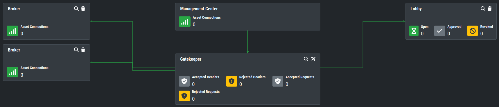

Installation of the Components
^^^^^^^^^^^^^^^^^^^^^^^^^^^^^^

You need a minimum of three additional servers in your environment to build a Broker Network. Please see :ref:`usage/requirements:Broker Network` for the required hardware.

The installation can be done as usual (see :ref:`usage/setup:Navigate through the installer`) with the provided ISO file. After the installation is done, you can choose the role you want to install:

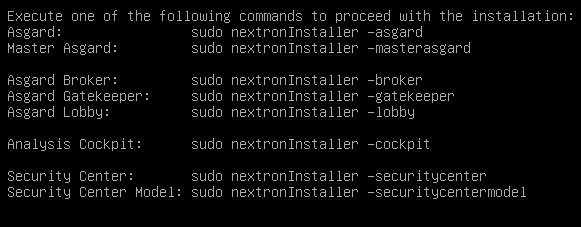

You can install the three servers in any order, as we will configure them once they are all up and running.

.. warning::
   The Broker Network needs a minimum version of 2.14.0 of the ASGARD Management Center. You also need the new/updated ISO installer image.

Gatekeeper
^^^^^^^^^^

To install the Gatekeeper, run the following command on a newly installed system: ``sudo nextronInstaller -gatekeeper``

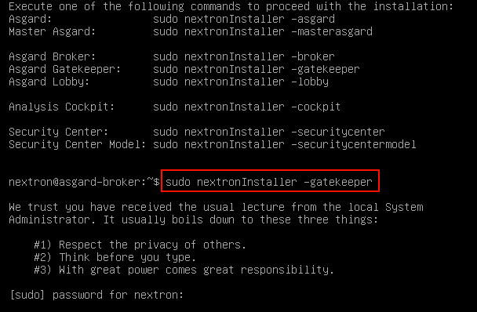

After the installation is done, you will see the following message:

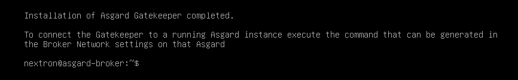

You can now check if the service was installed successfully. To do this, run ``systemctl status asgard2-gatekeeper.service``. You will see that the service is in a "failed/exited" state. This will change once we configured our ASGARD with the Gatekeeper.

To configure your Gatekeeper in the ASGARD Management Center, navigate to ``Asset Management`` > ``Broker Network``. If you do not see the ``Broker Network`` tab, you didn't install the correct license yet for your ASGARD.

From here you can click the edit button on the Gatekeeper:

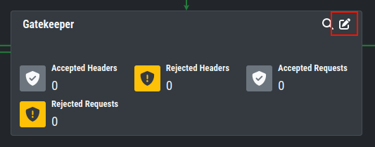

Once you clicked on the Edit Button, a pop-up will appear. Please set the FQDN of your gatekeeper.

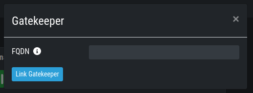

After you confirmed your Gatekeeper FQDN, you will get another pop-up with a command (``sudo asgard2-gatekeeper-install '<TOKEN>'``). Please copy this command and execute it on the gatekeeper via SSH:

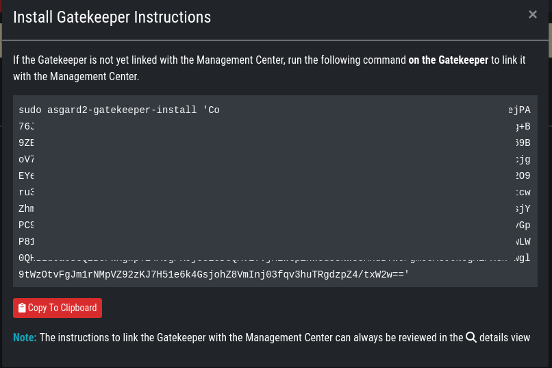

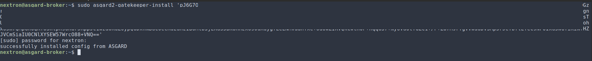

Once you are done, you can check the status and other settings of the Gatekeeper in your your ASGARD (magnifying glass icon):

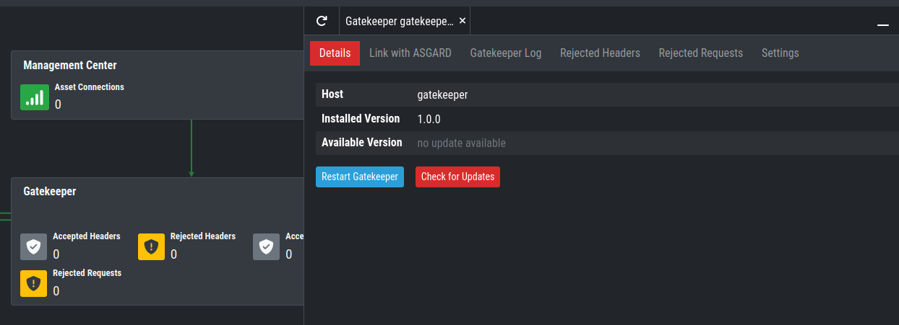

You might need to restart the Gatekeeper after the initial setup.

Lobby
^^^^^

To install the Lobby, run the following command on a newly installed system: ``sudo nextronInstaller -lobby``

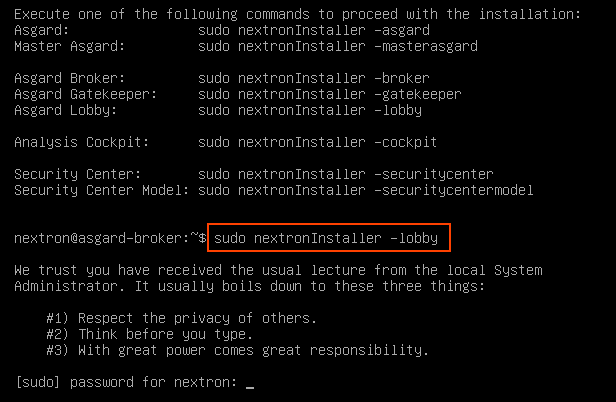

After the installation is finished, you will see the following message:

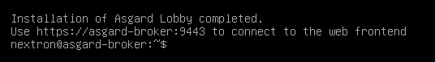

You can check the service to see if everything is up and running. To do this, run ``systemctl status asgard-lobby.service``.

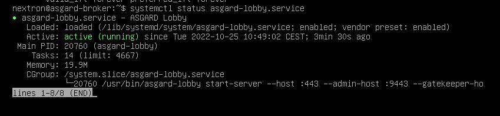

You can now navigate to the web interface of the lobby ``https://<FQDN>:9443``. Please log into the Lobby with the credentials of the user ``nextron``:

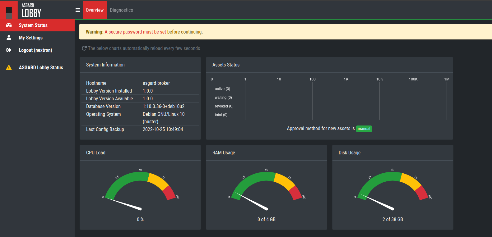

For the next steps, we need to set a secure password for the ``nextron`` user. This user will be only used to manage users on the Lobbies web interface. After changing the password, we need to create an administrative user. Changing the ``nextron`` users web password will not change the SSH password of the user!

After changing the password, you will be logged out of the Lobby. Log back into the Lobby. You are now able to see on the left navigation menu ``System Settings``. Go to the System Settings and add a new user. Make sure the new user has the ``Admin`` Role:

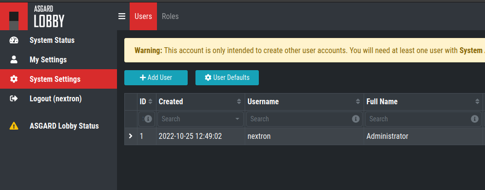

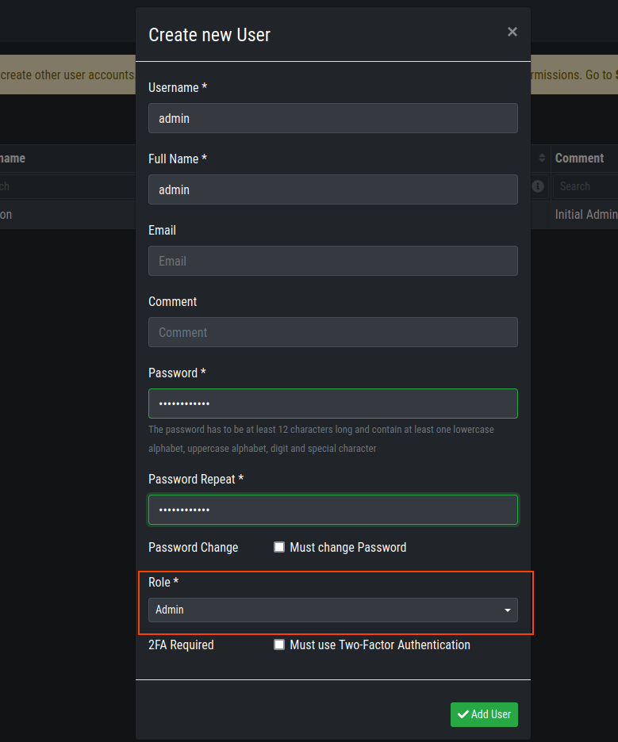

You can now log out of the Lobby and back in with the new admin user. You are now able to see on the left navigation menu ``Assets``. This will be used later on to accept new assets.

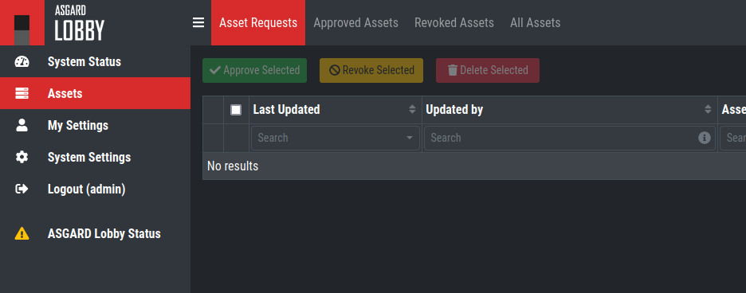

To configure your Lobby in the ASGARD Management Center, navigate to ``Asset Management`` > ``Broker Network``. If you do not see the ``Broker Network`` tab, you didn't install the correct license yet for your ASGARD. You can now add a new Lobby on the top right corner. Please fill in the FQDN again and click ``Submit``. You can assign a ``Group`` to group multiple Lobbies and Broker into one Group. If you are planning to only use one Lobby you can leave the value as ``default``. A pop-up will appear with configuration instructions. Download the configuration file, we will use this now in our Lobby.

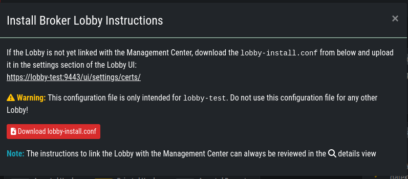

In your Lobby, navigate to ``System Settings`` > ``Lobby``. Here you can upload the configuration file we downloaded in the last step:

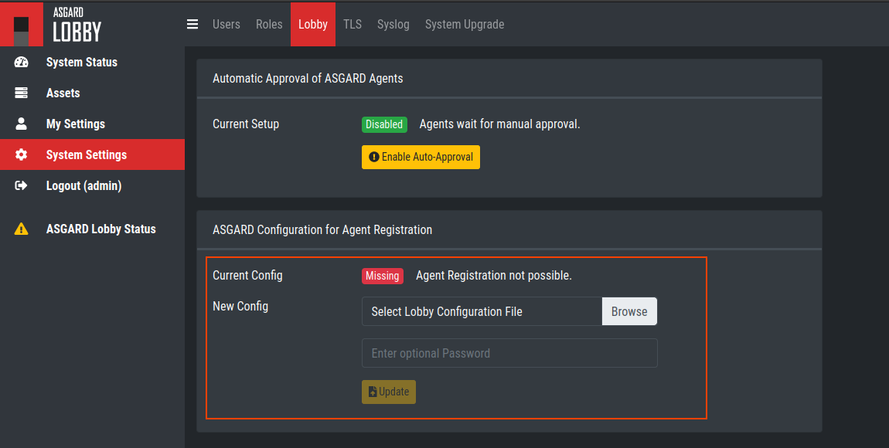

After you uploaded the configuration to your Lobby, you should now see that the Lobby is connected with your ASGARD Management Center:

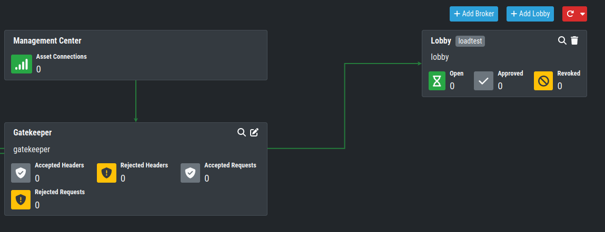

You might need to restart the Lobby after the initial setup.

Broker
^^^^^^

To install a Broker, run the following command on a newly installed system: ``sudo nextronInstaller -broker``

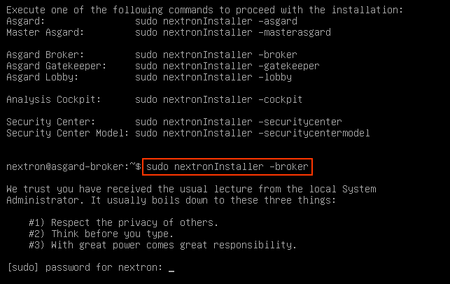

After the installation is finished, you will see the following message:

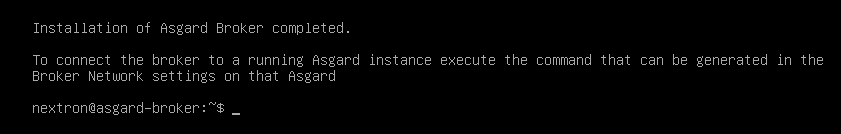

You can now check if the service was installed successfully. To do this, run ``systemctl status asgard-broker.service``. You will see that the service is in a "failed/exited" state. This will change once we configured our ASGARD with the Broker.

To configure your Broker in the ASGARD Management Center, navigate to ``Asset Management`` > ``Broker Network``. If you do not see the ``Broker Network`` tab, you didn't install the correct license yet for your ASGARD.

On the top right corner, click ``Add Broker``. Please fill in the FQDN for the Gatekeeper. Additionally, if the Broker should be reached via the open internet, you can assign a FQDN for the agents as well (make sure to set the A-Record in your public domain). You can leave the ``Group`` as default, but should change it accordingly if you set a different group earlier for your Lobby.

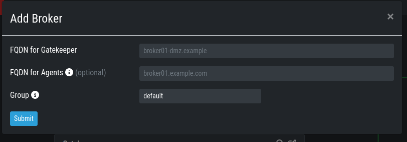

After you confirmed your Broker FQDN, you will get another pop-up with a command (``sudo asgard2-gatekeeper-install '<TOKEN>'``). Please copy this command and execute it on the broker via SSH:

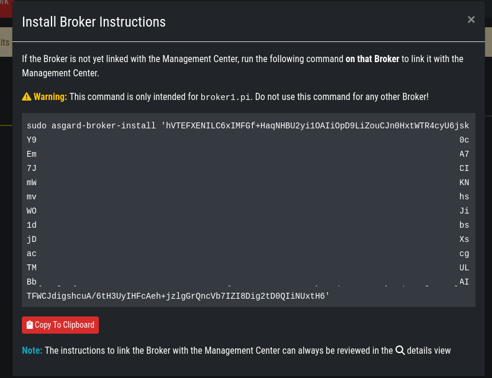

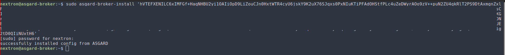

Once you are done, you can check the status and other settings of the Gatekeeper in your your ASGARD (magnifying glass icon):

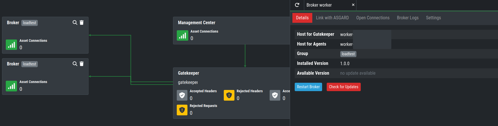

You might need to restart the Broker after the initial setup.

Agent Installer
^^^^^^^^^^^^^^^

After the Broker Network has been set up, you need to create a new Agent Installer. To do this, navigate on your ASGARD to ``Downloads`` > ``Agent Installers``. From here you can choose ``Add Agent Installers`` and set the configuration to your liking. Most importantly here is the Option for ``Broker Groups``. Set this to the value which you gave your Lobby and your Broker(s). After you added the agent installer, make sure to install it on the agents.

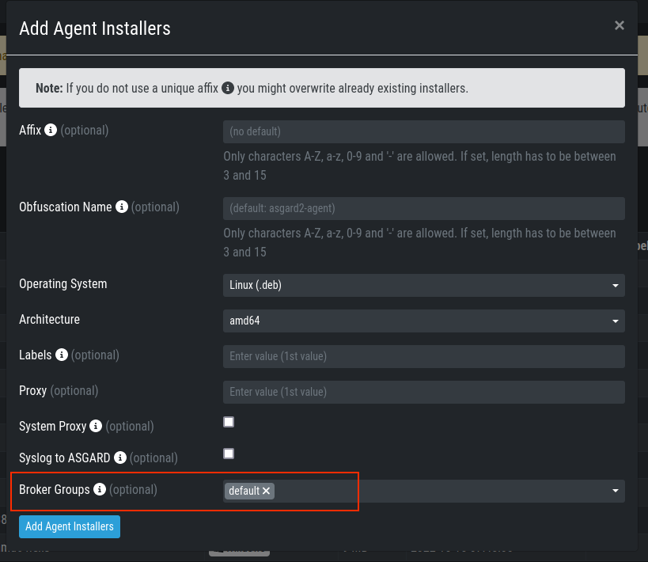

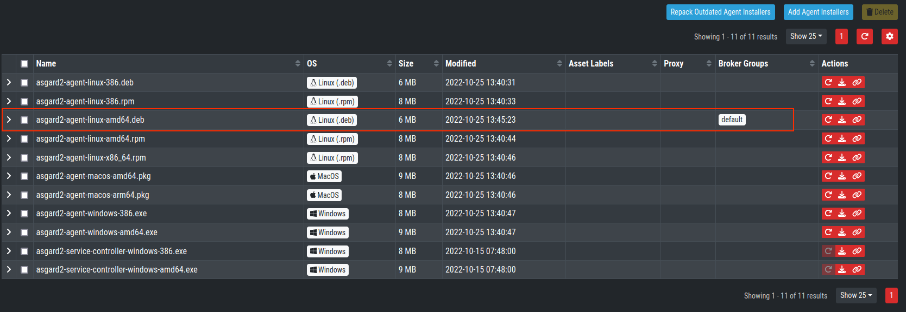
