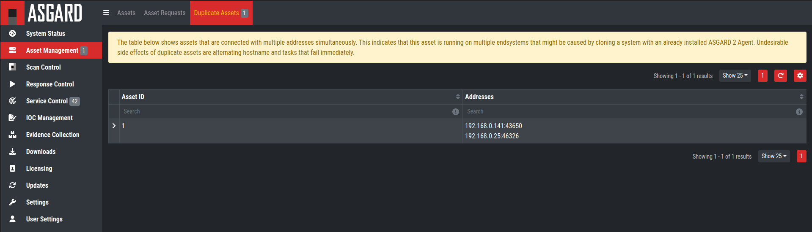

Troubleshooting
===============

Agent Debugging
---------------

Internal Agent Debugging
~~~~~~~~~~~~~~~~~~~~~~~~

Edit the file ``asgard2-agent.yaml`` and set the value of ``write_log`` to true. The file can be found in ``C:\Windows\System32\asgard2-agent\`` or ``/var/lib/asgard2-agent/`` for Windows and Linux/macOS, respectively.

.. code-block::

   write_log: true

After making these changes, restart the ASGARD service. You can then find log entries and possible error messages in the file ``asgard2-agent.log`` in the same directory as the configuration file.

Note: The value is set to ``false`` by default, because the agent doesn't rotate or compress these logs. Leaving that value on ``true`` could cause that file to grow very big and use a significant amount of disk space. We recommend resetting it after the debugging session.

Go Debug Logging
~~~~~~~~~~~~~~~~

On Windows, open the cmd.exe as Administrator. Set some environment variables.

.. code-block:: doscon 

   C:\Windows\system32>set GRPC_GO_LOG_SEVERITY_LEVEL=info
   C:\Windows\system32>set GODEBUG=http2debug=2

Navgiate into the agent's program directory and start it to see all output messages.

.. code-block:: doscon 

   C:\Windows\system32>sc stop asgard2-agent
   C:\Windows\system32>cd C:\Windows\system32\asgard2-agent\
   C:\Windows\system32\asgard2-agent>asgard2-agent.exe

Interrupt the agent with ``CTRL+C``. Don't forget to start the Windows service after the debugging session. 

.. code-block:: doscon

   C:\Windows\system32\asgard2-agent>sc start asgard2-agent

On Linux, open a shell as root (sudo). 

.. code-block:: console

   nextron@asgard:~$ sudo su -
   [sudo] password for nextron: 
   root@asgard:~# 
   root@asgard:~# export GRPC_GO_LOG_SEVERITY_LEVEL=info
   root@asgard:~# export GODEBUG=http2debug=2

Navgiate into the agent's program directory and start it to see all output messages.

.. code-block:: console 

   root@asgard:~# systemctl stop asgard2-agent
   root@asgard:~# cd /var/lib/asgard2-agent/
   root@asgard:/var/lib/asgard2-agent# ./asgard2-agent

Interrupt the agent with ``CTRL+C``. Don't forget to start the Linux service after the debugging session. 

.. code-block:: console 

   root@asgard:/var/lib/asgard2-agent# systemctl start asgard2-agent

Aurora Diagnostics Pack
~~~~~~~~~~~~~~~~~~~~~~~

If Aurora does not behave like it should, e.g. using more resources than you expected, you can create a diagnostics pack for our support to help in troubleshooting the issue. This can be conveniently done using the playbook ``[Default] Create and Collect Aurora Agent Diagnostics Pack (Windows)``.

It can be run from ``Asset Management`` > ``Response Action`` (Play button) or from ``Response Control`` > ``Tasks`` > ``Add Task`` or if needed as a group task. The resulting ``diagnostics.zip`` can be downloaded from the third step in the ``Playbook Result`` tab of the expanded task.

Duplicate Assets Remediation
~~~~~~~~~~~~~~~~~~~~~~~~~~~~

If you are seeing the ``Duplicate Assets`` view in your ``Asset Management``, you need to fix the issue to avoid unwanted behavior of this asset. To fix the issue, you need to uninstall the current ASGARD agent and redeploy a fresh copy.

   Troubleshooting Duplicate Assets

- To uninstall the ASGARD agent, please follow the instructions in :ref:`usage/administration:Uninstall ASGARD Agents`.
- To install the ASGARD agent, please follow the instructions in :ref:`usage/administration:ASGARD Agent Deployment`.

It is also recommended to redeploy the ASGARD Service Controller.

- To uninstall the ASGARD Service Controller, please follow the instructions in :ref:`usage/administration:Uninstall ASGARD Service Controller`.
- To install the ASGARD Service Controller, please follow the instructions in :ref:`usage/administration:Service Controller Installation`. You need to wait a few minutes until the asset is connected to your ASGARD before you continue with this step. Please note that you might need to accept the ``Asset Request``.

SSL Interception
----------------

Using a web proxy with TLS/SSL interception will break the installation routine and shows this error:

.. code-block::

   Certificate verification failed: The certificate is NOT trusted. The certificate issuer is unknown.  Could not handshake: Error in the certificate verification.

Solution: Disable TLS/SSL interception for our update servers. 

- update3.nextron-systems.com

Used for THOR updates:

- update1.nextron-systems.com
- update2.nextron-systems.com

We do not support setups in which the CA of the intercepting proxy is used on our ASGARD appliances. 

Using Hostname instead of FQDN 
------------------------------

The most common error is to define a simple hostname instead of a valid FQDN during installation. This happens in cases in which no domain name has been set in the setup step named "Configure the network". 

This leads to a variety of different problems. 

The most important problem is that ASGARD Agents that install on end systems will never be able to resolve and connect to the ASGARD server. 

Errors that appear in these cases 
~~~~~~~~~~~~~~~~~~~~~~~~~~~~~~~~~

.. code-block:: 

   Apr 23 12:07:12 debian10-dev/10.10.30.118 ASGARD_AGENT: Error: could not run: rpc error: code = Unavailable desc = connection error: desc = "transport: authentication handshake failed: x509: certificate is valid for wrong-fqdn, not asgard.nextron.internal"

How to Fix an unset or wrong FQDN
~~~~~~~~~~~~~~~~~~~~~~~~~~~~~~~~~

The FQDN is set at installation time and is composed by the hostname and the domain name. The ASGARD Agents require a resolvable FQDN to correctly operate and connect to the ASGARD Server.
One of the processes which are executed at installation time include the integration of the FQDN we set during installation into our agents. If we incorrectly set the FQDN or we leave any of those values empty , the agents will fail to connect to ASGARD.

With this fix we'll set a new FQDN for the ASGARD Server , recreate the internal certificates and rebuild the agents.

* Connect via SSH to the system.

 .. code-block:: console

   user@somehost:~$ ssh nextron@YOURASGARDSERVER

* Create a new file which will contain the script with the fix. In this example we'll use nano as the text editor.

 .. code-block:: console

   nextron@asgard:~$ nano fix-fqdn.sh

 Change the HOST and DOMAIN variable , make sure that the resulting FQDN is resolvable by the endpoints you deploy the agent to later.

 .. code-block:: bash

   #!/bin/bash
   # VARIABLES
   ############################################
   HOST="asgard"
   DOMAIN="internaldomain.net"
   FQDN=$HOST.$DOMAIN
   CLIENTCERTVALIDITY=36500
   ############################################
   hostnamectl set-hostname "$FQDN"

   openssl req -new -newkey rsa:4096 -days 36500 -nodes -x509 -subj "/O=Nextron Systems GmbH/CN=$FQDN" -keyout /etc/nextron/asgard2/server.key -out /etc/nextron/asgard2/server.pem

   openssl req -newkey rsa:4096 -nodes -subj "/O=Nextron Systems GmbH/CN=$FQDN" -keyout /etc/nextron/asgard2/client-service.key -out /etc/nextron/asgard2/client-service.csr

   openssl x509 -req -in /etc/nextron/asgard2/client-service.csr -CA /etc/nextron/asgard2/ca.pem -CAkey /etc/nextron/asgard2/ca.key -CAcreateserial -days $CLIENTCERTVALIDITY -out /etc/nextron/asgard2/client-service.pem

   asgard2-repacker -host $FQDN

* After changing the variables to the desired values , save the file. This can be done in "nano" pressing CTRL + X and confirming the changes

* Give the created script execution permissions

 .. code-block:: console

   nextron@asgard:~$ chmod +x fix-fqdn.sh

* Execute the script

 .. code-block:: console

   nextron@asgard:~$ sudo ./fix-fqdn.sh

Once the script has been executed the ASGARD service should be restarted.

* Restart the service

 .. code-block:: console

   nextron@asgard:~$ sudo systemctl restart asgard2

You should now be able to reach the ASGARD Server under the new FQDN. Navigate to ``https://FQDN:8443`` being the FQDN the one you defined earlier in the script.

You should now install the agents on the endpoints again. They should be communicating correctly back to ASGARD by now. Remember to review the network requirements section to ensure all needed ports are open to the ASGARD Management Center from the endpoint.

ASGARD Errors
-------------

ASGARD noticed that the THOR scan failed
~~~~~~~~~~~~~~~~~~~~~~~~~~~~~~~~~~~~~~~~

In some cases THOR fails to complete its scan and ASGARD reports the following error. 

.. code-block:: 

   ASGARD noticed that the THOR scan failed 

   could not remove temp directory: remove C:\Windows\Temp\asgard2-agent\12fa35a6762a\thor\signatures\sigma\windows\file_event_win_webshell_creation_detect.yms: The process cannot access the file because it is being used by another process. exit status 1
   (scan result does not exist)

The most likely reason for this error is an Antivirus interaction. The Antivirus killed the THOR process and still holds a handle to one of the signature files. The "THOR Launcher" can only report that the process was terminated and that it isn't able to remove all files because the Antivirus process still has that open handle on the file. 

Solution: 

Configure an Antivirus exclusion for THOR. See :ref:`section <usage/requirements:Antivirus or EDR Exclusions>` for more details.

Resetting TLS/SSL Certificates
------------------------------

Web GUI: Regenerate the Self-Signed Certificate
~~~~~~~~~~~~~~~~~~~~~~~~~~~~~~~~~~~~~~~~~~~~~~~

ASGARD ships with a self-signed certificate for its web interface that expires after 182 days. If you do not use your own CA infrastructure and want to renew the certificate or want to revert from a broken state, you can recreate a self-signed certificate. To do so log in using SSH and execute:

.. code-block:: console

   nextron@asgard:~$ sudo openssl req -new -newkey rsa:4096 -days 182 -nodes -x509 -subj "/O=Nextron Systems GmbH/CN=$(hostname --fqdn)" -keyout /etc/nextron/asgard2/server.key -out /etc/nextron/asgard2/server.pem

You need to restart ASGARD in order for the changes to take effect.

.. code-block:: console

   nextron@asgard:~$ sudo systemctl restart asgard2.service

Regenerate ASGARD Server Certififcate Agent Communication 
~~~~~~~~~~~~~~~~~~~~~~~~~~~~~~~~~~~~~~~~~~~~~~~~~~~~~~~~~

In order to reset the certificate that ASGARD uses to communicate with the agents, use the following commands. The agent should immediately trust the new certificate, as it was generated using the CA they already trust. 

.. code-block:: console 

   nextron@asgard:~$ su asgard2 -s /bin/sh <<'EOF'
   openssl req -new -nodes -subj "/O=Nextron Systems GmbH/CN=ASGARD Management Center" -key /etc/nextron/asgard2/client-service.key -out /etc/nextron/asgard2/client-service.csr
   openssl x509 -req -in /etc/nextron/asgard2/client-service.csr -CA /etc/nextron/asgard2/ca.pem -CAkey /etc/nextron/asgard2/ca.key -CAcreateserial -days 36500 -out /etc/nextron/asgard2/client-service.pem -extfile /etc/nextron/asgard2/server_cert_ext.cnf
   EOF

Admin User Password Reset 
-------------------------

If you've lost the password of the local ``admin`` user (Web GUI) but still have access the system via SSH, you can reset it via command line using the following command. 

.. code-block:: console 

   nextron@asgard:~$ sudo mysql asgard -e "UPDATE users SET password = 'YmIc6P_6jdbeEL0HY4xIcpYstmM' WHERE name = 'admin';"

This resets the password to ``admin``. You should then change that password immediately.

Reset Multi Factor Authentication for a specific user
-----------------------------------------------------

If you or another user lost their second factor (MFA) to log into the ASGARD Web UI, you can reset the users MFA Settings with the following command (in this example we assume that the user is called ``john``):

.. code-block:: console

   nextron@asgard:~$ sudo mysql asgard --execute "UPDATE users SET tfa_valid = 0 WHERE name = 'john';"

Scheduled Scans do not run at the correct time
----------------------------------------------

In some cases the timezone during the installation of the server image might not be correct. To see if you have this problem in your current installation, please log into your server and execute the following command:

.. code-block:: console

    nextron@asgard:~$ timedatectl
                   Local time: Mon 2022-10-24 09:52:03 BST
               Universal time: Mon 2022-10-24 08:52:03 UTC
                     RTC time: Mon 2022-10-24 08:52:04
                    Time zone: Europe/London (BST, +0100)
    System clock synchronized: no
                  NTP service: inactive
              RTC in local TZ: no

If you see that the **Time zone** is incorrect, follow the next steps to correct it.

List all the timezones with ``timedatectl list-timezones``. If you want to search for a specific Country/City, you can use grep, e.g. ``timedatectl list-timezones | grep Prague``.

Now that you have the correct timezone you can set it the following way:

.. code-block:: console

	nextron@asgard:~$ sudo timedatectl set-timezone Europe/Prague
	nextron@asgard:~$ timedatectl
 	               Local time: Mon 2022-10-24 10:56:45 CEST
            	   Universal time: Mon 2022-10-24 08:56:45 UTC
 	                 RTC time: Mon 2022-10-24 08:56:46
	                Time zone: Europe/Prague (CEST, +0200)
	System clock synchronized: no
	              NTP service: inactive
	          RTC in local TZ: no

Please reboot the system after the changes have been made.

**Note**: This might cause problems with existing Scheduled Scans!

Aurora is generating too many False Positives
---------------------------------------------

In some environments, Aurora might generate a high amount of False Positives. This should never be the case, since Aurora should only alert on very few and mostly important findings. Most likely a rule is matching on the environment and generates too many false positives. To circumvent this, you can disable the rule and set a filter later on. For Tuning, please see :ref:`usage/administration:False Positive Tuning of Sigma Rules`.
